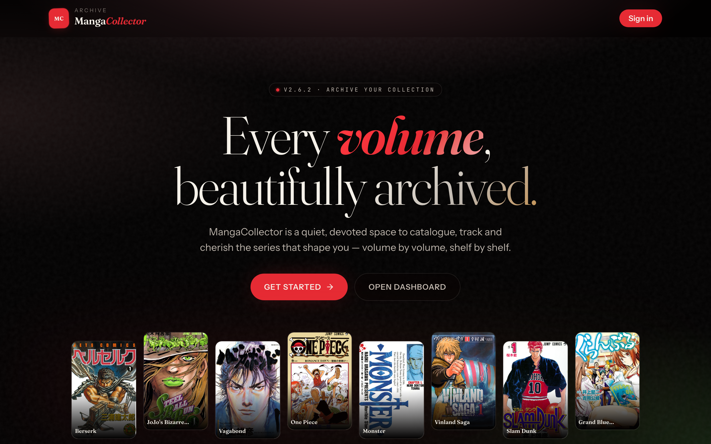
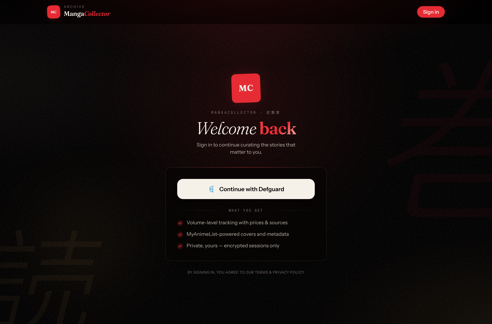
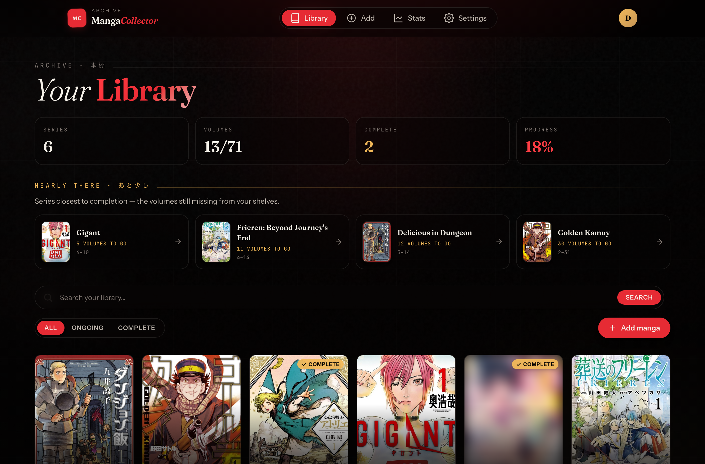
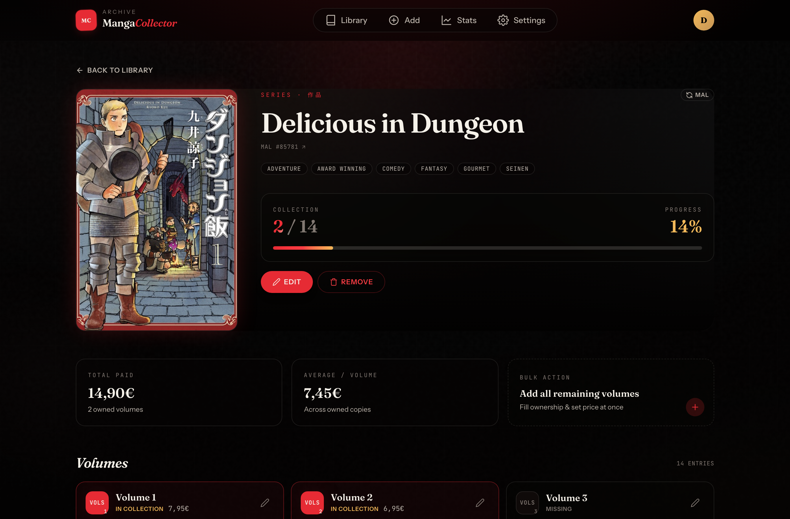
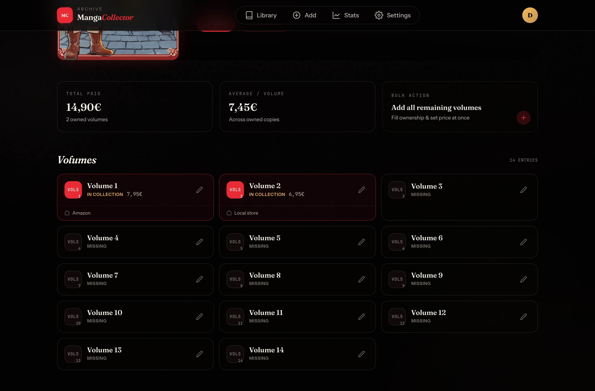
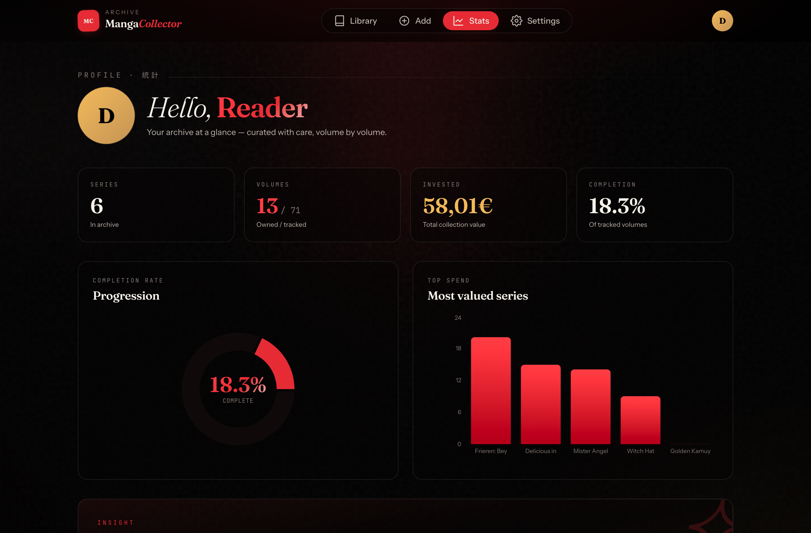

# MangaCollector

> **Archive what you collect — volume by volume.**

**MangaCollector** is a full-stack web app and PWA designed for manga collectors who want to track every tankōbon they own, log purchase prices and stores, surface what's missing on their shelves, and discover new series — all behind a Shōjo-Noir aesthetic (ink black, hanko red, washi cream, gold leaf).

It works **offline-first**, is **installable on iOS / Android / Desktop**, and ships with a hardened Rust backend running in read-only containers.

---

## Demo

| | |
|---|---|
| **Landing page** — about, hero, top manga from MAL |  |
| **Sign-in** — Google or generic OpenID Connect |  |
| **Library dashboard** — your shelf at a glance |  |
| **Series page** — bulk volume editing, cover swap, MAL refresh |  |
| **Volume editor** — per-volume ownership, price, store |  |
| **Profile / Statistics** — completion, spend, top series, activity feed, MAL recommendations |  |

---

## Features

### Collection
- **MAL-powered library** — search MyAnimeList for any series, auto-fill volumes, cover, genres, demographics
- **MangaDex merged search** — falls back to MangaDex for series MAL doesn't have, with a small modal to capture missing fields like volume count
- **Custom entries** — add a series neither MAL nor MangaDex have yet (assigned a negative `mal_id`)
- **Per-volume tracking** — ownership, price paid, store, **read status**, **collector flag**, **per-volume cover**, **freeform notes**
- **Bulk volume editing** on the series page, plus a volume detail drawer with consistent edit chrome across grid + shelf views
- **Two view modes** for the volumes grid — *ledger* (compact tile list) and *shelf* (3D-stacked tankōbon spines)
- **Coffrets / box sets** — group volumes that ship together (limited editions, slipcases, anniversary boxes), with cover, price, vendor and date metadata; writes are atomic and require connectivity to keep the server-side transaction consistent
- **Publisher / edition metadata** — track the imprint (Glénat, Kana, Pika…) and the edition variant (Standard, Kanzenban, Perfect, Deluxe…) per series
- **Genre editing** for custom-only rows — server-gated to entries that have no MAL or MangaDex link, so external syncs never clobber your manual tags
- **Manual upcoming-volume entry** — pencil in a future tome you've heard about (title, release date, ISBN, vendor URL) without waiting for the auto-scrapers
- **Custom poster upload** — replace the MAL cover with your own (stored in S3 / MinIO or local FS); custom uploads survive cross-device sync via a dedicated public poster endpoint
- **Title preference** — Default / English / Japanese / Romaji per user
- **Adult content filter** — 3 levels (off, blur, show)

### Discovery
- **Barcode scanner** — scan ISBN on a tankōbon, looks up Google Books → matches against MAL → suggests adding the series with the right volume number, **gap-fills missing earlier volumes** if any; manual ISBN entry tray as a fallback
- **MAL recommendations** — aggregates `recommendations` from your top series, ranks by votes
- **Gap suggestions** — series closest to completion ("only 2 volumes to go")
- **Activity feed** — additions, removals, completion, milestones (10/25/50/100/250/500/1000/2500/5000 volumes; 5/10/25/50/100/250/500/1000 series)
- **Library compare** at `/compare/{slug}` — three-bucket diff against another user's public profile (you have it / they have it / both), with one-click "add this to my library" on any series they own
- **Upcoming volumes calendar** at `/calendar` — month grid of every announced future tome across your series, plus a rotatable **ICS subscription URL** for Google / Apple / Outlook calendars
- **Auto-detected upcoming releases** — server-side scraper (MAL + MangaDex + Google Books cascade) surfaces a *next-volume* ribbon under series you've caught up on
- **Glossary page** at `/glossary` — public kanji reference covering every glyph the UI uses (集 coffret, 来 upcoming, 印 seal, 願 wishlist, …) with tap-to-copy

### Offline-first PWA
- **Installable** on Android (Chrome/Edge bannière), iOS Safari ("Sur l'écran d'accueil"), Desktop (Chrome/Edge install icon) with maskable icon for adaptive Android launchers
- **Works offline** — Dexie (IndexedDB) caches the entire library + volumes + settings, plus already-earned seals so the trophy shelf stays warm without a network
- **Optimistic mutations** — changes apply locally instantly; an outbox flushes them to the server when reachable
- **Cross-device live sync** — authenticated WebSocket pushes invalidations from the server, so a change made on your phone is reflected on your laptop within milliseconds (with exponential-backoff reconnect when the tab regains focus)
- **Smart connectivity** — detects "server unreachable" not just "navigator offline"
- **Pending logout** — queues logout when offline, fires it as soon as the server comes back
- **Force resync** — settings entry to wipe local cache and pull fresh from the server

### Personalisation & sharing
- **3 themes** — dark / light / auto (system) with zero-flash bootstrap
- **3 languages** — English / French / Spanish (server-stored, localStorage-cached)
- **Seasonal atmosphere** — opt-in ambient particles (sakura / fireflies / leaves / snow) that drift across the page based on the current season, astronomically accurate; honours `prefers-reduced-motion`
- **Custom avatar** — pick a character portrait from the series you own (live from MAL via Jikan), with live search and per-series chip-rail navigation
- **Seals** — 31 unlockable milestone trophies across 9 categories, 5 ink tiers (sumi → hanko → moegi → kin → shikkoku); newly-earned ones play an in-grid spotlight ceremony exactly once
- **Public profiles** — opt-in shareable read-only view at `/u/{slug}` (3-32 chars, lowercase + hyphens, reserved-name list), with a dedicated `/public/u/{slug}/poster/{mal_id}` endpoint so user-uploaded covers stay visible to anonymous visitors without leaking the rest of the library
- **Birthday mode** — time-bounded (7/30/90 days) public exposure of the wishlist so visitors can pick a gift from series you're tracking-but-don't-own-yet
- **Year-in-Review poster** — annual stat sheet (volumes added, top series, spending) ready to share
- **Shelf-sticker QR labels** — print-ready QR codes that deep-link to a series' page, sized for a real bookshelf
- **Welcome tour** — first-visit walkthrough; non-blocking, dismissible
- **Web Share Target + PWA shortcuts** — accept shared links from other apps and expose quick actions (scan, add manually) from the launcher menu
- **Active sessions modal** — list every device currently signed in, revoke individual sessions; rotates the session id on login as a session-fixation defence

### Security & ops
- Hardened containers: read-only rootfs, dropped Linux capabilities, `no-new-privileges`, non-root user (uid 65532), no package manager left in the runtime image
- OCI metadata labels documenting the security contract
- Static binary (musl) with **Rustls (aws-lc-rs)** end-to-end — zero OpenSSL on the wire, ~15 MB lighter image, and a whole class of `RUSTSEC-*-openssl-*` advisories simply can't apply
- Runs from `scratch` (no shell, no libc, no package manager)
- HEALTHCHECK self-implemented as a `--health` subcommand (no curl/wget needed in the image)

---

## Tech Stack

### Frontend
| Layer | Tooling |
|---|---|
| UI | **React 19.2** + **Vite 8** (Rolldown bundler — production builds in ≈400 ms) |
| Styling | **Tailwind CSS v4** (CSS-first config), custom OKLCH palette, custom Fraunces + Instrument Sans + JetBrains Mono + Noto Serif JP type stack |
| Routing | React Router 7 (lazy-loaded routes via `React.lazy`) |
| Server state | **TanStack Query 5** (offline-first network mode) + WebSocket-driven invalidations |
| Local cache | **Dexie 4** (IndexedDB) + `dexie-react-hooks` — library, volumes, settings, seals |
| Charts | Recharts 3 |
| PWA | `vite-plugin-pwa` (peer-dep override against Vite 8 until upstream 1.3.0 lands) + Workbox runtime caching (Google Fonts, MAL CDN, Jikan API, user posters) |
| Barcode | Native `BarcodeDetector` API with the **`barcode-detector`** WASM polyfill as a unified fallback |
| i18n | Custom `I18nProvider` + `useT` hook, 3 dictionaries |
| Build / lint | Node 24 (via nvm — `.nvmrc` provided), ESLint 10, Prettier 3.8 |

### Backend
| Layer | Tooling |
|---|---|
| Language / runtime | **Rust 2024 edition** (rustc ≥ 1.85), Tokio async runtime |
| Web framework | **Axum 0.8** (with `ws` feature) + tower-http 0.6 + `tower_governor` 0.8 (rate-limiting) |
| ORM | **SeaORM 1.1** wrapping **sqlx 0.8** (PostgreSQL, rustls, with-chrono, with-rust_decimal) |
| Sessions | tower-sessions 0.14 + tower-sessions-sqlx-store 0.15 (PostgreSQL-backed) |
| Realtime | Axum WebSocket handler at `/api/ws` — per-user broadcast for cross-device cache invalidation |
| Auth | **openidconnect 4** (Google OAuth 2.0 *or* generic OpenID Connect, configurable via `AUTH_MODE`) |
| Cache (optional) | Redis 8 via `redis` 1.2 + `deadpool-redis` 0.23 — disabled at runtime if `REDIS_URL` is unset |
| Storage | aws-sdk-s3 1.x (MinIO / S3-compatible) **or** local filesystem fallback |
| TLS | **Rustls** with `aws-lc-rs` everywhere (`reqwest`, `aws-sdk-s3`, `sqlx`, `sea-orm`) — no OpenSSL in the dependency tree |
| HTTP client | reqwest 0.12 (rustls-tls, default features off) |
| Errors | thiserror 2 + anyhow 1 |
| Logging | tracing + tracing-subscriber |

### Infrastructure
- **PostgreSQL 15** for relational data + session store
- **Redis 8** as an optional cache (Jikan / MAL responses, hot library snapshots) — the server runs fine without it
- **MinIO / S3** for cover uploads (optional — falls back to local FS via `STORAGE_DIR`)
- **Traefik v2** as reverse proxy (dev + prod)
- **Docker Compose** (dev + prod variants)

---

## Project layout

```
.
├── client/                # React 19 + Vite 8 PWA
│   ├── src/
│   │   ├── components/    # Pages + UI primitives (Dashboard, MangaPage, AddCoffretModal, SealsPage, PublicProfile, …)
│   │   ├── hooks/         # useLibrary, useVolumes, useSettings, useSeals, useRealtimeSync, …
│   │   ├── lib/           # db.js (Dexie), sync.js (outbox), connectivity.js, theme.js, barcode.js, …
│   │   ├── i18n/          # en.js / fr.js / es.js
│   │   └── styles/        # Tailwind v4 + Shōjo Noir palette
│   ├── public/            # PWA icons (192, 512, maskable, apple-touch-icon)
│   ├── nginx.conf         # Hardened nginx config (writes only to /tmp)
│   └── Dockerfile         # Multi-stage build → nginx alpine + OCI security labels
│
├── server/                # Rust + Axum backend
│   ├── src/
│   │   ├── handlers/      # HTTP route handlers (incl. realtime.rs WebSocket)
│   │   ├── services/      # Business logic (library, coffrets, seals, public profiles)
│   │   ├── models/        # SeaORM entities
│   │   ├── routes/        # Router composition
│   │   └── auth.rs        # OIDC client + AuthenticatedUser extractor
│   ├── migrations/        # SQL migrations (embedded at compile time via sqlx::migrate!)
│   ├── Dockerfile         # Multi-stage → scratch runtime + OCI security labels
│   └── Cargo.toml
│
├── docker-compose.yml     # Dev stack (db + redis + traefik + server + client)
├── docker-compose.prod.yml
└── docs/
    ├── TIMELINE.md            # Step-by-step development history (see end of README)
    ├── release-calendar-proxy.md
    └── screenshots/
```

---

## Running locally

### Prerequisites
- **Docker** (with BuildKit, default since v23) **or**
- **Node 24** (via [nvm](https://github.com/nvm-sh/nvm) — a `.nvmrc` is provided in `client/`)
- **Rust 1.85+** (a `rust-toolchain.toml` is provided in `server/`)
- **PostgreSQL 15** (only if running the server outside Docker)

### Full stack (recommended)
```bash
docker compose up
```
Open http://localhost:12000 (Traefik). The Traefik dashboard is on http://localhost:8080.

### Client only (hot-reload dev)
```bash
cd client
nvm use            # picks up .nvmrc → Node 24
npm install
npm run dev        # Vite on :5173 with --host
```

### Server only (hot-reload dev)
```bash
cd server
cargo run          # Axum on :3000
# or
cargo watch -x run # if you have cargo-watch
```

### Lint / build
```bash
cd client && npm run lint && npm run build
cd server && cargo check && cargo build --release
```

---

## Configuration

All server config lives in environment variables (see [`server/.env.example`](server/.env.example)).

| Variable | Purpose |
|---|---|
| `PORT` | HTTP listen port (default 3000) |
| `POSTGRES_URL` | DB DSN |
| `AUTH_MODE` | `google` or `openidconnect` |
| `AUTH_CLIENT_ID` / `AUTH_CLIENT_SECRET` | OAuth credentials |
| `AUTH_ISSUER` | OIDC issuer URL (when `AUTH_MODE=openidconnect`) |
| `AUTH_NAME` / `AUTH_ICON` | Display name + icon shown on the login page |
| `SESSION_SECRET` | Signing key for session cookies |
| `FRONTEND_URL` | Used for CORS + OAuth redirect URI |
| `STORAGE_DIR` | If set, use local filesystem for poster uploads |
| `S3_*` | If set instead, use S3/MinIO for poster uploads |
| `REDIS_URL` | Optional. When set (e.g. `redis://redis:6379/1`), enables the response cache layer; otherwise the server runs cache-less |
| `APP_UNSECURE_HEALTHCHECK` | Set to `true` to allow non-loopback `/api/health` (e.g. for Uptime Kuma) |

---

## Deployment

The image story is the same in dev and prod — **multi-stage Docker builds + read-only runtime**.

### Backend
- Built on `rust:alpine` with **Rustls (aws-lc-rs)** TLS — the whole `openssl` / `openssl-sys` chain is gone, both at build time and at runtime — and the resulting static musl binary is copied into `FROM scratch`
- ~22 MB final image (≈15 MB lighter than the OpenSSL-linked build), no shell, no package manager
- Runs as non-root, with `cap_drop: ALL` and `read_only: true` in Compose / k8s
- HEALTHCHECK: the binary itself accepts a `--health` subcommand that loops back to `/api/health` and exits 0/1
- OCI labels (`security.readonly-rootfs`, `security.tmpfs`, `security.caps.drop`, …) document the runtime contract

### Frontend
- Built on `node:24-alpine` → static dist served by `nginx:alpine`
- nginx `pid` + temp paths redirected into `/tmp` so the rootfs can be read-only
- Capabilities pruned to the minimum nginx needs (`CHOWN`, `SETUID`, `SETGID`, `NET_BIND_SERVICE`)
- Aggressive caching — hashed `assets/*` get `Cache-Control: public, max-age=31536000, immutable`; `index.html`, `sw.js`, `registerSW.js` get `no-cache`

### Docker Compose runtime hardening (already wired)
```yaml
read_only: true
security_opt:
  - no-new-privileges:true
cap_drop:
  - ALL
tmpfs:
  - /tmp:rw,noexec,nosuid,size=16m
```

### Reverse proxy / TLS
The supplied `docker-compose.yml` uses Traefik v2 in plain HTTP for local dev. **For production, point Traefik at Let's Encrypt** (or any TLS-terminating reverse proxy) — HTTPS is non-negotiable for:
- Service worker registration
- PWA install prompts (`beforeinstallprompt` is gated on secure context)
- OAuth callback security

---

## Why I built this

I'm a manga collector. Spreadsheets and memory don't scale to long-running series — by volume 30 of *One Piece* you've forgotten what you paid for #14 and which obi was on the limited edition #22.

The project was also a chance to push on:
- **Offline-first architecture** with optimistic mutations + a coalesced outbox (no log-replay surprises) and Dexie-backed caches that survive a cold start
- **Cross-device realtime** without a third-party broker — a single Axum WebSocket route with per-user broadcast, authenticated by the same session cookie the REST endpoints use
- **Hardened container delivery** — scratch image, dropped capabilities, read-only rootfs, OCI security labels, and a fully Rustls / `aws-lc-rs` TLS stack so OpenSSL CVEs simply don't apply
- **Distinctive visual identity** — committing to a single bold direction (Shōjo Noir) rather than the default "indigo gradient + Inter" SaaS look
- **Full-stack Rust backend** — Axum, SeaORM, openidconnect, AWS SDK, all on the latest stable releases
- **Modern build pipeline** — Vite 8 / Rolldown produces a complete production build (≈140 chunks + a Workbox-driven service worker precaching ~50 assets) in under half a second

---

## Roadmap

- Smart shelf grouping (by demographic, era, publisher)
- Wishlist with pre-order tracking and price alerts
- Native mobile wrapper via Capacitor (the PWA already covers the core experience)
- Edition / coffret marketplace links (publisher pre-orders surfaced from the coffret detail view)

---

## Project history

For a step-by-step view of how the project evolved — from a bare URL-cleanup
fork through OAuth + Knex foundations, the full Rust port, the seal system,
public profiles, realtime sync, and the Shōjo-Noir UI overhaul — see
**[`docs/TIMELINE.md`](docs/TIMELINE.md)**.

The timeline also marks the point at which development began with assistance
from Claude (Anthropic) — every commit from that anchor onward was written
in pair with the assistant.

---

## Contact

Questions, feedback or fellow-collector enthusiasm welcome — reach out via GitHub Issues, or through the contact links on my GitHub profile.
