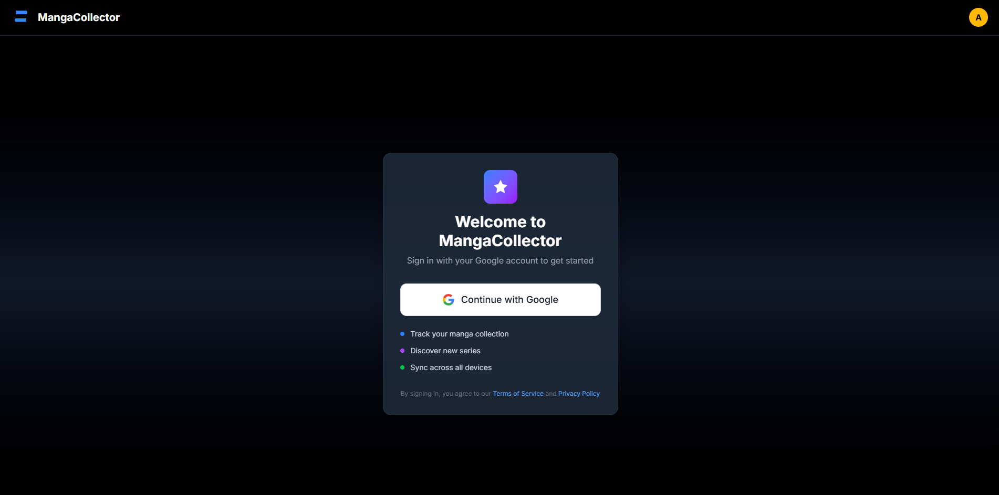

# MangaCollector  

**MangaCollector** is a web platform designed for manga enthusiasts to track, manage, and grow their manga collections. Users can catalog owned volumes, log purchase details, and fetch series information directly from the **MyAnimeList (MAL) API** for accurate and up-to-date metadata.  

The app combines clean UI design, robust backend architecture, and authentication via **Google OAuth 2.0**, making collection management seamless and secure.  

---

## Features  

- **Google OAuth 2.0 Authentication**  
  Secure sign-in using Google accounts, ensuring fast and reliable access for users.  

- **Manga Library Management**  
  Add manga to your personal library, track total volumes, and mark which ones you own.  

- **Volume Tracking**  
  Each volume entry includes ownership status, price paid, and store of purchase.  

- **MAL API Integration**  
  Fetches manga metadata (title, volumes, cover art, etc.) directly from **MyAnimeList**, keeping the collection accurate.  

- **Notes & Personalization**  
  Add additional notes or details to individual manga entries.  

- **Responsive Design**  
  Fully functional across desktop and mobile for on-the-go collection management.  

---

## Demo

> TBD

- **Dashboard**  
    

- **Manga Library View**  
    

- **Volume Editing**  
    

- **Authentication (Google OAuth)**  
    

You can also add a demo GIF recorded with [ScreenToGif](https://www.screentogif.com/) or [RecordIt](https://recordit.co/) to show login → search manga → edit volume flow.  

---

## Tech Stack  

### Frontend  
- React (with hooks and component-based architecture)  
- Tailwind CSS for modern, responsive styling  
- React Router for client-side navigation  

### Backend  
- Node.js with Express.js  
- PostgreSQL for relational data storage  
- Google OAuth 2.0 for authentication  
- Axios for external RESTful API requests  
- dotenv for environment configuration  

---

## Deployment  

> TBD

---

## Why I Built This  

As both a developer and a manga collector, I found that managing a collection across spreadsheets or memory quickly became overwhelming, especially with long-running series. **MangaCollector** solves this by centralizing ownership tracking, purchase history, and series info in one place.  

The project was also an opportunity to deepen my skills in:  
- Designing **full-stack applications** with authentication and relational databases.  
- Working with a **third-party API (MAL)** and integrating it smoothly into a user-facing product.  
- Delivering a polished, recruiter-ready project with attention to both **frontend design** and **backend architecture**.  

---

## Future Plans  

- Social features (compare collections with friends)  
- Mobile version via React Native  
- Price analytics (track spending on manga over time)  

---

## Contact  

If you're a recruiter, developer, or fellow collector interested in the project, feel free to connect with me via **LinkedIn** or **email** (details in my GitHub profile).  

