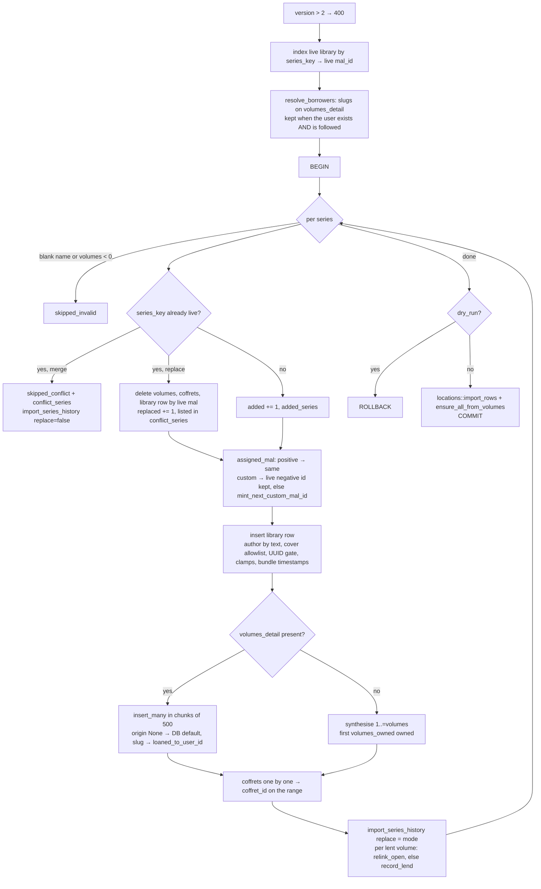

# Archive: export / import / restore · 箱

> The portable copy of a library. `GET /api/user/export.json` writes
> everything the data model holds into one flat JSON bundle
> (`ExportBundle` v2); `POST /api/user/import` reads one back in
> `merge` or `replace` mode, with a `dry_run` preview. The same bundle
> shape is what the external importers produce (MyAnimeList by XML or
> username, AniList, a MangaDex list, a Yamtrack CSV), so one importer
> serves every path into the library. A CSV flattening exists for
> spreadsheets and is one-way. Reached from Settings → Account; every
> endpoint needs a session.

## Mental model

**One shape in, one importer.** Nothing enters the library in bulk
except as an `ExportBundle`. Our own export is one; each external
source is parsed or fetched into one (`wrap_bundle` in
`services/external_import.rs`), previewed with a dry-run merge and
handed back to the client, which re-posts it to the same
`POST /api/user/import`. `apply_import_merge` in `services/archive.rs`
is therefore the single place where a series, its volumes, coffrets,
loans and places are written from outside.

**Identity is not the id.** A bundle series is matched against the
library by `series_key`: a positive `mal_id` wins; otherwise a
canonical MangaDex UUID (lower-cased); otherwise the title with
whitespace collapsed and lower-cased. A negative `mal_id` is never an
identity — it is minted per instance from `custom_library_id_seq`, so
the same MangaDex or custom series carries a different one in every
library, and honouring it made re-importing your own backup duplicate
every non-MAL series. Imported negative ids are never written.

**Merge keeps, replace swaps, both preview.** `merge` (default) leaves
a series that is already there untouched and reports it as a conflict
— but still merges the bundle's ledger rows for it. `replace` deletes
the live series (volumes and coffrets included), re-inserts the
bundle's version under the same live id and counts it as `replaced`;
this is what "restore my backup" means on the account the backup came
from. `dry_run: true` walks the same code and rolls back. Everything a
live run writes happens in one transaction, so a failure mid-bundle
leaves nothing half-imported.

**A bundle is attacker-authored.** Every value is re-validated on the
way in with the rule the live write path applies: cover URLs through
`cover_pool::allowed_cover_url`, `mangadex_id` through
`util::uuid::is_canonical_uuid`, counts through
`library::clamp_volumes` (0..=10 000), `condition` through
`normalize_condition`, `isbn` through `util::isbn::normalize_isbn13`,
`extra_copies` clamped to 0..=99, `reading_status` through
`normalize_reading_status`, `times_read` floored at 0. Anything that
fails is dropped, never fatal. A borrower is re-linked only to an
account the importer follows.

**Exported, not imported.** `user.name` and `settings` travel for a
human reader and are ignored on import (`build_export` writes them,
`apply_import_merge` never reads them). The CSV export has no import.

## Data

`ExportBundle` (`server/src/models/archive.rs`, `EXPORT_VERSION = 2`):

| Field | Meaning |
|---|---|
| `version` | `2`. The importer refuses `version > 2` with a 400; a v1 file imports with every v2 field `serde(default)`. |
| `exported_at`, `source` | ISO-8601 UTC; `"MangaCollector"`, or `"MangaCollector external import · <service>"`. |
| `user.name`, `settings` | Display name; `{currency, titleType, adult_content_level, theme, language}`. Informational. |
| `library[]` | `ExportSeries`, sorted by lower-cased name. |
| `loan_history[]` | `ExportLoan` — the ledger, oldest first (v2, default empty). |
| `locations[]` | `ExportLocation {name, note?, position}` — the places registry (v2, default empty). |

`ExportSeries`: `mal_id?`, `mangadex_id?`, `name`, `volumes`,
`volumes_owned`, `image_url_jpg?`, `genres[]`, `publisher?`, `edition?`,
`review?`, `review_public`, `author?` (the *name* — author ids are per
instance; the importer resolves the text through
`author::resolve_author_from_text_tx`), `created_on?`, `modified_on?`,
`reading_status?`, `started_reading_at?`, `finished_reading_at?`,
`times_read`, `volumes_detail[]`, `coffrets[]`.

`ExportVolume`: `vol_num`, `owned`, `price?`, `store?`, `collector`,
`read_at?`, `notes?`, `in_coffret` (advisory only); the release fields
`release_date?` / `release_isbn?` / `release_url?` / `origin?` /
`announced_at?`; the loan `loaned_to?` / `loan_started_at?` /
`loan_due_at?` / `loaned_to_slug?` (the linked borrower's public slug,
never an id); the physical copy `condition?` / `location?` /
`extra_copies` / `bought_at?` / `isbn?`; `created_on?` / `modified_on?`.
`ExportCoffret`: `name`, `vol_start`, `vol_end`, `price?`, `store?`,
timestamps — membership is restored by range, ids are recomputed.

`ExportLoan`: `mal_id` (the bundle's series id, re-mapped like the
volumes), `vol_num`, `series_name`, `borrower`, `borrower_slug?`,
`loaned_at`, `due_at?`, `returned_at?`.

Every `Option` is `skip_serializing_if = None`, so a v2 file stays as
lean as v1. Prices are `rust_decimal::Decimal` serialised as strings
(`serde-with-str`), never floats. A minimal v2 file:

```json
{
  "version": 2, "exported_at": "2026-09-13T10:00:00Z", "source": "MangaCollector",
  "user": {"name": "dim"}, "settings": null,
  "library": [{
    "mal_id": 13, "mangadex_id": null, "name": "One Piece", "volumes": 110,
    "volumes_owned": 3, "image_url_jpg": "https://cdn.myanimelist.net/images/manga/2/253146.jpg",
    "genres": ["Action"], "review_public": false, "times_read": 0,
    "volumes_detail": [{"vol_num": 1, "owned": true, "collector": false, "price": "7.50",
      "loaned_to": "Alex", "loaned_to_slug": "friend-alex",
      "loan_started_at": "2026-09-01T12:00:00Z", "extra_copies": 0}],
    "coffrets": [{"name": "Box", "vol_start": 1, "vol_end": 3}]
  }],
  "loan_history": [{"mal_id": 13, "vol_num": 1, "series_name": "One Piece",
    "borrower": "Alex", "borrower_slug": "friend-alex", "loaned_at": "2026-09-01T12:00:00Z"}],
  "locations": [{"name": "Étagère A", "note": "Salon", "position": 0}]
}
```

`ImportRequest`: `{dry_run?: bool, mode?: "merge" | "replace", bundle}`.
`ImportPreview` (returned by the dry run and the real run alike):
`total_in_file`, `added`, `replaced`, `skipped_conflict`,
`skipped_invalid` (blank name or `volumes < 0`), `added_series[]` and
`conflict_series[]` of `{mal_id, name, volumes, owned_volumes}` —
`owned_volumes` counts `volumes_detail`, so it reads 0 for an external
bundle even when `volumes_owned` is not.

There is no archive table. The bundle is assembled from
`user_libraries`, `user_volumes`, `coffrets`, `settings`, `authors`,
`users` (borrower slugs), `loan_history` and `locations` with one bulk
query each, grouped in memory. The CSV (`build_export_csv`) is one line
per volume — `mal_id,series,vol_num,owned,collector,read_at,price,store,notes,genres`,
genres joined with `|`, a series without volume rows gets one summary
line — and carries none of the loan, release or physical fields.

## Flows

Export:

```mermaid
flowchart LR
  A[Settings → ArchiveSection<br/>Export JSON / CSV] --> B[useArchive.download<br/>axios responseType blob]
  B --> C[GET /api/user/export.json or .csv]
  C --> D[build_export<br/>settings, library, volumes, coffrets: one query each]
  D --> E[author names by id<br/>borrower slugs by loaned_to_user_id]
  E --> F[loan_history::all_for_export<br/>locations::all_for_export]
  F --> G[ExportBundle sorted by name<br/>or build_export_csv]
  G --> H[download_response<br/>attachment mangacollector-slug-yyyymmdd.ext<br/>Cache-Control no-store]
  H --> I[blob URL + a.download click<br/>filename from Content-Disposition]
```



Import — `apply_import_merge(db, user, bundle, dry_run, mode)`:



External import (`/settings/import-external`):

```mermaid
flowchart LR
  A[ImportExternalPage] --> B[readImportFile<br/>gzip magic bytes → DecompressionStream]
  A --> C[POST /api/user/import/external/mal · mal-xml · anilist · mangadex · yamtrack]
  B --> C
  C --> D[fetch_* or parse_*<br/>≤ 500 series, 10 s per upstream call, volumes_detail empty]
  D --> E[wrap_bundle: source label, no settings, empty ledger and places]
  E --> F[finalise_preview: apply_import_merge dry_run=true, merge]
  F --> G[{bundle, preview} to the client]
  G --> H[useExternalImport.commit<br/>POST /api/user/import dry_run=false, default merge]
```

## Endpoints

All under the session-guarded `/api/user` nest. Route table:
`server/src/routes/api.rs`.

| Method | Path | Handler fn | Service fn | Notes |
|---|---|---|---|---|
| GET | `/api/user/export.json` | `archive::export_json` | `archive::build_export` | Pretty-printed bundle, `application/json`, `Content-Disposition: attachment; filename="mangacollector-{slug|name|user-id}-{yyyymmdd}.json"`, `Cache-Control: no-store, max-age=0`. |
| GET | `/api/user/export.csv` | `archive::export_csv` | `build_export` + `build_export_csv` | Same filename scheme, `text/csv; charset=utf-8`, formula-injection guard (`csv_escape`). No import counterpart. |
| POST | `/api/user/import` | `archive::import_archive` | `archive::apply_import_merge` | Body `{dry_run?, mode?, bundle}`; returns `ImportPreview`. 400 on `version > 2`. The body is bounded by `MAX_BODY_SIZE_MB` (default 10). No realtime event is published. |
| POST | `/api/user/import/external/mal` | `external_import::import_mal` | `fetch_mal_by_username` | `{username}`; Jikan `GET /v4/users/{u}/mangalist?page=n`, at most 50 pages. |
| POST | `/api/user/import/external/mal-xml` | `external_import::import_mal_xml` | `parse_mal_xml` | `{xml}` — the official export, unpacked client-side. Pure; 400 without a `<myanimelist>` root or when truncated. |
| POST | `/api/user/import/external/anilist` | `external_import::import_anilist` | `fetch_anilist_by_username` | `{username}`; GraphQL at `graphql.anilist.co`. List status is not mapped. |
| POST | `/api/user/import/external/mangadex` | `external_import::import_mangadex` | `fetch_mangadex_by_input` | `{input}` — a list URL, a list UUID or several manga UUIDs. Unknown UUIDs are skipped silently; `volumes_owned = 0`. |
| POST | `/api/user/import/external/yamtrack` | `external_import::import_yamtrack` | `parse_yamtrack_csv` | `{csv}`; needs `media_id`, `source`, `media_type`, `title`; `mal_id` only when `source = mal`; `volumes = 0`. |

The five external endpoints answer `{bundle, preview}` where `preview`
is a dry-run *merge*; nothing is written until the client posts the
bundle to `/api/user/import`.

## Client

- `components/ArchiveSection.jsx` — mounted in
  `components/settings/ChapterAccount.jsx` (Settings → Account → tools).
  Two export buttons and a three-step import modal: *choose*
  (`accept=".json,application/json"`, `JSON.parse`, refused unless
  `version` is truthy and `library` is an array), *preview*
  (`ModePicker` merge / replace — switching re-runs the dry run and the
  Apply button's number follows; a `role="alert"` warning when replace
  would touch anything; Apply disabled while `added + replaced === 0`),
  *done*. A link leads to the external-import page.
- `hooks/useArchive.js` — `exportJson` / `exportCsv` fetch the download
  as a blob and click an `<a download>`, taking the filename from
  `Content-Disposition`; `preview(bundle, mode)` and
  `commit(bundle, mode)` share `importPayload(bundle, mode, dryRun)`
  (`IMPORT_MODES = ["merge", "replace"]`, anything else → `merge`). A
  commit invalidates `["library"]` and `["volumes-all"]` — nothing else.
- `components/ImportExternalPage.jsx` (route `/settings/import-external`)
  + `hooks/useExternalImport.js` — one mutation per service returning
  `{bundle, preview}`, and `commit(bundle)` which posts
  `{dry_run: false, bundle}` (merge; no mode picker on this page).
  `lib/importFile.js::readImportFile` sniffs the gzip header `1f 8b`
  and inflates through `DecompressionStream`, so MAL's `.xml.gz` can be
  dropped in as is.
- Offline: export and import are online-only; no outbox, no Dexie
  mirror. After a commit the app relies on the two invalidations above
  to refill Dexie through the usual `cache*` writers; coffrets, loans
  and locations refresh on their own stale/focus cycle.

## Invariants & gotchas

- **Identity.** `series_key` is the only conflict rule. Custom titles
  match loosely (`"  Mon   Manga "` = `"mon manga"`), so two hand-made
  series that differ only in spacing or case are one series to the
  importer; a second copy of a series inside the same bundle is a
  conflict. A malformed `mangadex_id` falls back to the title.
- **Ids.** A replaced custom series keeps the negative id it already
  had, so activity rows and snapshots keep pointing at it; a new one
  gets `mint_next_custom_mal_id`. Coffret ids are always new;
  membership is rebuilt from `vol_start..=vol_end` and `in_coffret` on
  a volume is ignored.
- **Merge still merges loans.** A conflicting series in merge mode is
  not skipped entirely: its ledger rows are imported with `DO NOTHING`,
  so a library kept before the ledger existed gains its history without
  the live series being touched.
- **Borrower re-link.** `resolve_borrowers` collects slugs from
  `volumes_detail[].loaned_to_slug` only and keeps those that exist here
  *and* are followed by the importer — the rule `set_loan` applies. A
  ledger row whose `borrower_slug` is not also on a currently lent
  volume is imported with `borrower_user_id = NULL` **and**
  `borrower_slug = NULL` (`slug = borrower_user_id.and(…)` in
  `import_series_history`): the text handle survives, the link and the
  slug do not. The code does not say whether that is intended.
- **Open loans on restore.** After the volumes are written, every row
  with `loaned_to` gets its open ledger row re-attached (`relink_open`
  by user / mal / vol) or, for a bundle that predates the ledger, opened
  (`record_lend` with `loaned_at = loan_started_at`). In replace mode
  `import_row` upserts `returned_at` from the bundle, so a loan returned
  after the backup is open again — the verifier's second scenario
  asserts exactly that. Details in `docs/modules/loans.md`.
- **Cover allowlist.** `allowed_cover_url` keeps `https://` (and
  upgrades `http://`) on `COVER_HOSTS` — `myanimelist.net`,
  `mangadex.org`, the wixmp host, `anilist.co`, `books.google.com`,
  `googleusercontent.com`, `covers.openlibrary.org`, `openlibrary.org`
  — matched exactly or as a `.suffix`, plus server-relative `/…` paths
  without `//` or `..`; userinfo, other schemes and unknown hosts become
  `None` (the series is kept, the cover lost). The client CSP `img-src`
  in `client/security-headers.conf` names specific hosts (`cdn.myanimelist.net`,
  `uploads.mangadex.org`, `mangadex.org`, `s4.anilist.co`,
  `*.googleusercontent.com`, `covers.openlibrary.org`, …), so the server
  list is a superset: a URL on another subdomain of an allowed domain is
  stored but will not render.
- **Defaults on the way in.** `origin: None` leaves the column `NotSet`
  (DB default `manual`); missing `created_on` / `modified_on` become
  `now()` (a v1 bundle turns into "added today"); an unknown
  `condition` or `reading_status` is dropped rather than rejected;
  `volumes_owned` is clamped to `volumes`.
- **External bundles have no volume rows.** `volumes_detail` is empty,
  so the importer synthesises `1..=volumes` and marks the first
  `volumes_owned` owned — the "I have tomes 1 through N" convention.
  MAL XML: `my_retail_volumes` beats `my_read_volumes`, `Completed`
  with a known total owns the run, `volumes` is at least the owned
  count when MAL reports 0, `my_comments` becomes a private `review`
  (≤ 4000 chars), statuses map to `reading / completed / paused /
  dropped / planned`, id-less entries are skipped. Every source caps at
  `MAX_ENTRIES = 500`.
- **Coffret `collector`.** The header comment in `models/archive.rs`
  says v2 carries "the coffret `collector` flag"; there is no such
  column — `collector` on `CreateCoffretRequest` is a create-time
  cascade onto the member volumes (`services/coffret.rs`), and the
  bundle carries the result on each `ExportVolume.collector`.
  `ExportCoffret` has no `collector` field.
- **Places.** `locations::import_rows` fills what is missing in merge
  mode (a new place, a blank note) and takes the bundle's note and
  position as truth in replace mode; `ensure_all_from_volumes` then
  registers every name typed on a tome, so a bundle older than the
  registry still ends with one row per place.
- **No realtime fan-out.** `handlers/archive.rs` never publishes on the
  `SyncBroker` — the "realtime broadcast that fires after this function
  returns" mentioned in the service does not exist. Other devices see
  an import on their next focus refetch.
- **Dry run is real work.** It opens and rolls back a transaction and
  runs every validation; only the library index and
  `resolve_borrowers` run outside the transaction.
- **Size.** The bundle is one JSON body, so `MAX_BODY_SIZE_MB` (default
  10) is the practical ceiling; volume inserts are chunked by 500 to
  stay under Postgres' 65 535 parameters per statement.
- **CSV.** `csv_escape` prefixes `=`, `+`, `@`, TAB, CR and a `-` not
  followed by a digit or `.` with `'`, so a series called
  `=HYPERLINK(…)` stays text in a spreadsheet. The loans CSV reuses it.
- Any new column on `user_libraries`, `user_volumes`, `coffrets`,
  `loan_history` or `locations` must be added to the bundle *and* to
  the field lists in `scripts/verify-archive-roundtrip.mjs`, which fails
  on a dropped field.

## Where it lives

| File | Role |
|---|---|
| `server/src/models/archive.rs` | `EXPORT_VERSION`, `ExportBundle`, `ExportSeries`, `ExportVolume`, `ExportCoffret`, `ExportLoan`, `ExportLocation`, `ImportRequest`, `ImportMode`, `ImportPreview` |
| `server/src/services/archive.rs` | `build_export`, `build_export_csv`, `csv_escape`, `series_key`, `resolve_borrowers`, `import_series_history`, `apply_import_merge` |
| `server/src/handlers/archive.rs` | The three endpoints, `download_response`, `download_filename` (shared with the loans CSV) |
| `server/src/services/external_import.rs` | Jikan, AniList, MangaDex, Yamtrack, MAL XML → `wrap_bundle`; `MAX_ENTRIES`, `EXTERNAL_FETCH_TIMEOUT` |
| `server/src/handlers/external_import.rs` | `{bundle, preview}` endpoints, `finalise_preview` |
| `server/src/services/loan_history.rs`, `services/locations.rs` | `all_for_export`, `import_row`, `relink_open`, `record_lend`; `import_rows`, `ensure_all_from_volumes` |
| `server/src/services/cover_pool.rs` | `COVER_HOSTS`, `host_allowed`, `allowed_cover_url` |
| `server/src/services/library.rs`, `services/author.rs`, `util/uuid.rs`, `util/isbn.rs` | `clamp_volumes`, `mint_next_custom_mal_id`; `resolve_author_from_text_tx`; `is_canonical_uuid`; `normalize_isbn13` |
| `server/src/routes/api.rs` | `/export.json`, `/export.csv`, `/import`, `/import/external/*` |
| `server/src/main.rs` | `MAX_BODY_SIZE_MB` → `DefaultBodyLimit` |
| `client/security-headers.conf` | The CSP `img-src` the cover allowlist mirrors |
| `client/src/components/ArchiveSection.jsx`, `components/settings/ChapterAccount.jsx` | Export buttons, import modal, mount point |
| `client/src/hooks/useArchive.js` | Blob downloads, `importPayload`, preview / commit mutations |
| `client/src/components/ImportExternalPage.jsx`, `hooks/useExternalImport.js`, `lib/importFile.js` | External-import wizard, per-service mutations, gzip unpacking |
| `scripts/verify-archive-roundtrip.mjs`, `scripts/verify-mal-xml-import.mjs`, `scripts/lib/stack-client.mjs` | Real-stack verifiers and their headless login helper |
| `docs/test-stack.md` | How to run them |

## Tests & verification

Server (`cargo test`): `models/archive.rs::wire_tests` (4 — a v1
series deserialises with the v2 fields defaulted, `None` options are
omitted, `mode` defaults to `merge` and parses `replace`, the
`replaced` counter serialises); `services/archive.rs::identity_tests`
(4 — a positive MAL id wins, negative ids are not identities, a
malformed UUID falls back to the title, custom titles match loosely);
`services/external_import.rs` (11 — the MAL XML mapping: retail over
read volumes, unknown totals, `Completed`, capping, plan-to-read,
entity unescaping, non-MAL files and truncation rejected, dates and
re-reads, status by name or code); `services/cover_pool.rs::allowlist_tests`
(3). `build_export`, `apply_import_merge` and the CSV flattening have
no unit tests — the database path is only covered by the script below.

Client (`pnpm test`): `components/ArchiveSection.test.jsx` (5 — the
merge / replace choice re-runs the dry run, warns, commits with the
previewed policy, and replace unlocks Apply when a merge adds nothing);
`hooks/useArchive.test.jsx` (6 — the `importPayload` wire shape, merge
dry run by default, replace forwarded, commit policy, a server
rejection surfaced); `lib/importFile.test.js` (4 — gzip sniffing and
inflation, non-ASCII intact).

Local stack (`docs/test-stack.md`): with the stack up and seeded,
`node scripts/verify-archive-roundtrip.mjs` enriches the seeded user
(series fields, reading progression, three loans — one linked to a
followed `friend-alex` account — notes, the physical copy and two real
ISBNs, a pencilled upcoming volume, a coffret, an annotated place),
exports, imports into a fresh `restore-check-*` user in merge mode,
then damages the source (fields cleared, a loan returned, a note and a
place note wiped, a coffret deleted) and restores it with
`mode: replace`. Both API views are diffed field by field — volumes,
coffrets, the ledger (`GET /api/user/volume/loans/history`) and the
places registry — and the run prints `LOSSLESS` or a per-field loss
table and exits 1 (also on any duplicated series).
`node scripts/verify-mal-xml-import.mjs` posts a hand-built MAL export
as an `xml-check-*` user, checks the preview mapping, commits and reads
the library back. Both re-run safely.
