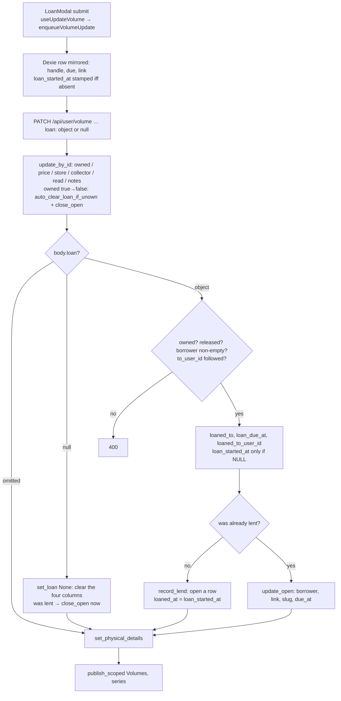
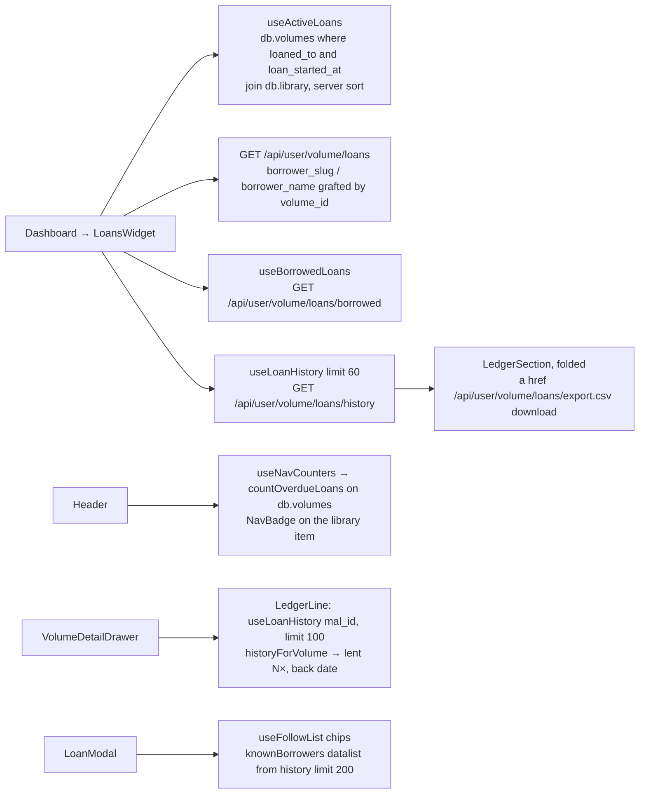
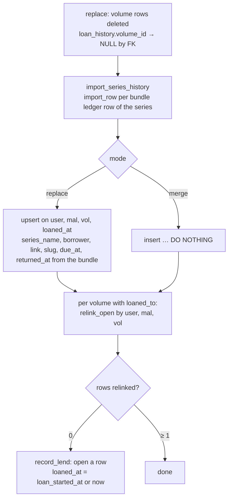

# Loans, borrowing, the ledger · 預け

> Which tomes are out of the house, with whom, since when and until
> when — and the record of every loan ever made. A loan is four
> nullable columns on the `user_volumes` row (`loaned_to`,
> `loaned_to_user_id`, `loan_started_at`, `loan_due_at`), written by
> the ordinary volume PATCH; the `loan_history` table is the ledger that
> outlives the return. A borrower who is a followed friend sees the
> volume on their own dashboard. Used by every signed-in user; the
> ledger is exportable as CSV and travels in the archive bundle.

## Mental model

**A loan is an overlay on ownership.** A lent tome is still
`owned = true` — it counts in stats, seals and the public profile — it
is merely off the shelf. `loaned_to IS NOT NULL` is the whole
definition of "out"; `loan_started_at` is set with it and cleared with
it (service-enforced, no CHECK); `loan_due_at` is independent, `NULL`
meaning open-ended. There is no status enum: *overdue* is computed by
whoever reads the row (`due < now`).

**Every write goes through two functions.** `services/volume.rs::set_loan`
handles lend, edit and return from the `loan` field of
`PATCH /api/user/volume`; `update_by_id` auto-clears the four columns
when the same PATCH flips `owned` from true to false. Both call into
`services/loan_history.rs`, and so does the archive importer — the
module header states the rule: any other path that touches the loan
columns leaves a hole in the history.

**The ledger is append-and-close.** One `loan_history` row per loan:
inserted on lend (`record_lend`), rewritten while open (`update_open`),
closed on return (`close_open` sets `returned_at`). Application code
never deletes a row; `series_name` and `borrower_slug` are snapshotted
so renaming later does not rewrite the past. The `volume_id` link is a
convenience the FK drops (`SET NULL`) when the volume row is deleted or
rebuilt; the identity is `(user_id, mal_id, vol_num, loaned_at)`.

**Friends are a link, not a replacement.** `loaned_to` always carries
the display handle. `loaned_to_user_id` is set only when the lender
follows the borrower (`user_follows`, which itself requires the target
to have a `public_slug`), and it is what makes the volume appear on the
borrower's side (`/loans/borrowed`). Typing a name in the modal drops
the link; a deleted borrower account leaves the handle behind.

**The client renders Dexie first.** The dashboard widget scans
`db.volumes` for lent rows and joins `db.library`, so it works offline
and updates optimistically through the outbox; the server listing only
grafts the friend's slug and name onto it. The ledger and the borrowed
list are online-only queries.

## Data

`user_volumes` — `20260504120000_add_volume_loan_tracker.sql` and
`20260913120000_volume_loan_friend.sql`:

| Column | Meaning |
|---|---|
| `loaned_to TEXT` | Borrower handle, trimmed, cut at 80 chars (`LOAN_BORROWER_MAX_CHARS`). `NULL` = not lent. |
| `loan_started_at TIMESTAMPTZ` | When the tome left. Stamped on the first lend only, preserved by edits, cleared on return. |
| `loan_due_at TIMESTAMPTZ` | Expected return; `NULL` = open-ended. Rewritten on every lend or edit. |
| `loaned_to_user_id INTEGER NULL REFERENCES users(id) ON DELETE SET NULL` | The borrower's account when followed; `NULL` for a free-text borrower. |

Indexes: `idx_user_volumes_loan_active (user_id, loan_due_at) WHERE
loaned_to IS NOT NULL` (the lender's list) and
`user_volumes_loaned_to_user_idx (loaned_to_user_id) WHERE
loaned_to_user_id IS NOT NULL` (the borrower's list).

`loan_history` — `20260913160000_loan_history.sql`:

| Column | Meaning |
|---|---|
| `id BIGSERIAL` | |
| `user_id INTEGER NOT NULL … ON DELETE CASCADE` | The lender. Account deletion removes the ledger through this FK; `users::delete_account` does not touch the table. |
| `volume_id INTEGER NULL REFERENCES user_volumes(id) ON DELETE SET NULL` | The row while it exists; `NULL` once deleted or rebuilt by an import. |
| `mal_id INTEGER NOT NULL`, `vol_num INTEGER NOT NULL` | The tome. `mal_id` is `0` for a volume without a series and the per-instance negative id for a custom one. |
| `series_name TEXT NOT NULL` | Snapshot at lend time (`""` when the series is gone). |
| `borrower TEXT NOT NULL`, `borrower_user_id … ON DELETE SET NULL`, `borrower_slug TEXT` | Handle, link, and the slug as it was at lend or last edit. |
| `loaned_at TIMESTAMPTZ NOT NULL` | The volume's `loan_started_at` at lend time. |
| `due_at`, `returned_at TIMESTAMPTZ NULL` | `returned_at IS NULL` = still out. |

Indexes: `loan_history_user_loaned_idx (user_id, loaned_at DESC)`,
`loan_history_open_idx (volume_id) WHERE returned_at IS NULL`, and the
identity `UNIQUE (user_id, mal_id, vol_num, loaned_at)`
(`loan_history_identity_idx`) — "a tome cannot be lent twice at the
same instant", which is what lets every insert be an upsert. The
migration backfilled a row for every loan open at the time
(`loaned_at = COALESCE(loan_started_at, now())`).

Wire shapes (`server/src/models/volume.rs`, `models/loan_history.rs`):

```
PATCH /api/user/volume   { id, owned, price, store, collector, read?, notes?,
                           loan?: null | { to, due_at?, to_user_id? }, …physical fields }
ActiveLoan               { volume_id, mal_id, vol_num, series_name, series_image_url,
                           loaned_to, loan_started_at, loan_due_at,
                           loaned_to_user_id, borrower_slug, borrower_name }
BorrowedVolume           { volume_id, mal_id, vol_num, series_name, series_image_url,
                           lender_id, lender_slug, lender_name, loan_started_at, loan_due_at }
loan_history::Model      { id, user_id, volume_id, mal_id, vol_num, series_name, borrower,
                           borrower_user_id, borrower_slug, loaned_at, due_at, returned_at }
```

`loan` is three-state (`deserialize_optional_loan`): omitted = leave
alone, `null` = return, object = lend or edit. The CSV
(`loan_history::to_csv`) opens with a UTF-8 BOM and the header
`series,volume,borrower,borrower_slug,lent_on,due_on,returned_on,status`;
dates are `YYYY-MM-DD`, `status` is `out | overdue | returned` judged
at request time.

Client (Dexie, `client/src/lib/db.js`): the `volumes` store carries the
four loan columns like any other volume field; there is no `loans`
table. `outboxVolumes.payload.loan` carries the raw patch, `null`
included.

## Flows

Lend, edit, return — one PATCH; handler order in
`handlers/volume.rs::update_volume`:



Read paths:



Archive restore (`services/archive.rs`; see `docs/modules/archive.md`):



## Endpoints

All under the session-guarded `/api/user` nest. The four literal
`/volume/loans…` routes are registered ahead of `/volume/{mal_id}`
(`server/src/routes/api.rs`).

| Method | Path | Handler fn | Service fn | Notes |
|---|---|---|---|---|
| PATCH | `/api/user/volume` | `volume::update_volume` | `volume::update_by_id`, then `volume::set_loan`, then `set_physical_details` | `loan` rides on the ordinary volume PATCH (outbox-replayed). 400: not owned, upcoming, blank borrower, `to_user_id` not followed. Missing or foreign row → silent 200. Publishes `Volumes` scoped to the series. |
| GET | `/api/user/volume/loans` | `volume::list_loans` | `volume::list_active_loans` | Every row with `loaned_to` and a `loan_started_at`, joined with the series name/cover and the friend's `public_slug`/`name`. Order: due asc, undated last, then started asc. `[]` when none. |
| GET | `/api/user/volume/loans/borrowed` | `volume::list_borrowed` | `volume::list_borrowed` | Rows where `loaned_to_user_id = me`; series identity from the **lender's** library row; `lender_slug` / `lender_name` may be `null`. Same order. |
| GET | `/api/user/volume/loans/history?limit&mal_id` | `volume::list_loan_history` | `loan_history::list` | Newest first; `limit` default 200, clamped 1..=500 (`LIST_MAX`); optional series filter. Raw `loan_history::Model` rows. |
| GET | `/api/user/volume/loans/export.csv?from&to` | `volume::export_loans_csv` | `loan_history::all_for_export` + `to_csv` | `from` / `to` are `YYYY-MM-DD`, inclusive on the lend date. Download `mangacollector-loans-{slug}-{yyyymmdd}.csv`, `text/csv; charset=utf-8`, `no-store`. |
| GET / POST / DELETE | `/api/user/follows`, `/api/user/follows/{slug}` | `follow::*` | `services/follow.rs` | The link's precondition: `{user_id, public_slug, display_name}` rows the modal offers as chips; following needs the target's `public_slug`. |

## Client

- `components/LoansWidget.jsx` — mounted in `Dashboard.jsx` once the
  initial load is done ("Manifest of absences"). Self-hides when the
  active list, the borrowed list and the ledger are all empty.
  `DueCard`s classify with `classifyLoan`: `overdue` (due passed),
  `due_soon` (under 7 days), `active`, `open` (no due date); a linked
  friend shows `友 @slug`; a card navigates to `/mangapage` with
  `state.manga.mal_id`. `BorrowedSection` lists what friends lent me —
  lender name, else `@slug` linking to `/u/{slug}`, else
  `loans.borrowedFromUnknown` ("a collector without a public profile").
  `LedgerSection` is a folded `<details>` ("Ledger · EVERY LOAN")
  showing the first 40 of the 60 newest rows (`@borrower_slug` or the
  handle, `lent → returned` or "still out") with a plain
  `<a href="/api/user/volume/loans/export.csv" download>` link.
- `components/LoanModal.jsx` — mounted by `Volume.jsx`, reads the
  volume from Dexie by id. Friend chips from `useFollowList()`
  (`/api/user/follows`, Dexie-cached); picking one sets `to_user_id` and
  fills the name; typing clears the link. The borrower `<input>` has a
  `<datalist>` from `lib/loanHistory.js::knownBorrowers(history)` over
  `useLoanHistory({limit: 200})` and `maxLength={80}`; the due date is
  an `<input type=date>` turned into an ISO instant. Submits
  `loan: {to, due_at, to_user_id}` or `loan: null` through
  `useUpdateVolume` — the outbox path, so it works offline.
- `components/VolumeDetailDrawer.jsx` — `LoanChip` (lent: borrower and
  due date, red when overdue; not lent: a "lend" CTA) renders only when
  the parent passes `onOpenLoanModal`, the tome is owned and released —
  the client half of the server's 400. `LedgerLine` reads
  `useLoanHistory({malId, limit: 100})` and renders `historyForVolume`
  as "lent N×" plus "back {date}"; nothing when the tome never went out.
- `hooks/useActiveLoans.js` — `useActiveLoans()`: Dexie live query
  (`loaned_to && loan_started_at`, library join, the server's sort)
  merged with `["loans", "active"]` (`staleTime` 60 s) for
  `borrower_slug` / `borrower_name`; `useBorrowedLoans()`:
  `["loans", "borrowed"]`, online only; `classifyLoan(loan, now)`.
- `hooks/useLoanHistory.js` — `["loans", "history", malId ?? "all",
  limit]`, default limit 300, `staleTime` 60 s, online only.
- `hooks/useNavCounters.js` + `lib/navCounters.js::countOverdueLoans` —
  lent rows with `loan_due_at < now` in `db.volumes`, rendered by
  `NavBadge` on the `library` nav item (`/dashboard`) in `Header.jsx`.
  No request behind it.
- `lib/loanHistory.js` — pure: `knownBorrowers(history, currentLoans)`
  (current borrowers first, then the ledger newest first, trimmed and
  deduplicated case-insensitively) and
  `historyForVolume(history, malId, volNum)` → `{count, open,
  lastReturnedAt}`.
- `lib/sync/outbox.js::enqueueVolumeUpdate` — mirrors the patch onto
  the Dexie row (`null` clears the four columns; an object sets handle,
  due date and link, and stamps `loan_started_at` only when the row had
  none — the client copy of `set_loan`'s rule), carries the raw `loan`
  in the payload and keeps a pending one on merge (`"loan" in prev`);
  the flusher sends `loan` only when present.

## Invariants & gotchas

- `loaned_to` and `loan_started_at` are set and cleared together by
  the service; nothing in the schema enforces it. Both listings drop a
  row with a handle but no start (`let started = v.loan_started_at?`),
  and the widget's Dexie filter requires both.
- **Lending needs a real copy.** `set_loan` refuses a tome that is not
  owned or is upcoming (`release_date > now`), a blank borrower, and a
  `to_user_id` the lender does not follow — each a 400. Returning
  (`loan: null`) is always allowed, even on a legacy row that is lent
  but unowned.
- **Edits keep the lend date.** `loan_started_at` is minted once; an
  edit rewrites borrower, link and `due_at` only, and `update_open`
  mirrors them onto the open ledger row (with a refreshed
  `borrower_slug`). The ledger's `loaned_at` therefore equals the
  volume's `loan_started_at` for the life of the loan.
- **Un-owning returns.** `update_by_id` clears the four columns when
  `owned` goes true → false and closes the open ledger row
  (`returned_at = now`). A PATCH that un-owns *and* sends a `loan`
  object gets the clear first and then a 400 from `set_loan`.
- **Deleting does not return.** Deleting a series
  (`library::delete_manga`), shrinking its volume count
  (`remove_volume_by_num_tx`) or an archive `replace` deletes the volume
  rows; the FK nulls `loan_history.volume_id` and nothing closes the
  row. An open loan on a deleted tome stays "still out" in the ledger
  (and in `historyForVolume().open`), leaves the active list and the
  badge with the row, and cannot be returned from the UI.
- **The UNIQUE key is the ledger's idempotency.** `record_lend` and
  `import_row` upsert on `(user_id, mal_id, vol_num, loaned_at)`.
  Because `loaned_at` is the volume's own `loan_started_at`, exporting
  and re-importing the same open loan lands on the same row. In
  **replace** mode `import_row` rewrites `returned_at` from the bundle,
  so a row closed after the backup is reopened, and `relink_open` then
  re-attaches it to the rebuilt volume; in **merge** mode the insert is
  `DO NOTHING`, so the live closure wins. A bundle without
  `loan_history` (pre-ledger) gets rows opened from the volumes' loan
  fields with `loaned_at = loan_started_at`.
- **Borrower re-link on import** resolves slugs from the volumes'
  `loaned_to_slug` only and keeps followed accounts only; a ledger row
  whose borrower is not on an open loan comes back with
  `borrower_slug = NULL` and no link
  (`services/archive.rs::import_series_history`). Details in
  `docs/modules/archive.md`.
- **`mal_id` in the ledger** is `unwrap_or(0)` for a volume without a
  series and the per-instance negative id for a custom one; the
  importer re-maps bundle ids to live ids, so a restore on another
  instance keeps the ledger attached to the right series.
- **Snapshots, not joins.** `series_name` and `borrower_slug` are
  copied at lend (and edit) time. Renaming a series or changing a slug
  later leaves past rows as they were; the ledger UI and the CSV show
  what was true then.
- **Realtime.** A lend publishes `Volumes` for the *lender*; the
  widget's Dexie source refreshes through the ordinary volumes refetch.
  `["loans", …]` keys are not in `realtimePlan.js::KIND_TO_KEYS`, so the
  ledger and the borrowed list refresh only on their own stale/focus
  cycle, and the borrower's device receives no event at all when a
  friend lends to them.
- **Overdue** is `due < now` on the reader's clock in the badge
  (`countOverdueLoans`), the widget (`classifyLoan`), the drawer chip,
  and on the server's clock in the CSV `status`. Nothing is stored.
- **Deleted accounts.** Lender: `loan_history.user_id ON DELETE CASCADE`.
  Borrower: `loaned_to_user_id` and `borrower_user_id` go `NULL`, the
  handle stays, and the active list simply shows no `@slug`.
- **Limits.** Handle cut at 80 chars silently (mirrored by `maxLength`);
  history at most 500 rows per request, no pagination — the widget asks
  for 60, the modal 200, the drawer 100 per series, the hook default is
  300. The CSV export has no cap.
- The CSV link is a plain anchor with `download`: it needs the session
  cookie (same origin) and does nothing offline.

## Where it lives

| File | Role |
|---|---|
| `server/src/services/volume.rs` | `set_loan`, `auto_clear_loan_if_unown` and the `close_open` call in `update_by_id`, `list_active_loans`, `list_borrowed`, `loan_order`, `lookup_users` |
| `server/src/services/loan_history.rs` | `LIST_MAX`, `LendRecord`, `record_lend`, `update_open`, `close_open`, `list`, `all_for_export`, `relink_open`, `ImportedLoan`, `import_row`, `to_csv` |
| `server/src/handlers/volume.rs` | `update_volume` (ordering), `list_loans`, `list_borrowed`, `list_loan_history` (`LoanHistoryQuery`), `export_loans_csv` (`LoanExportQuery`) |
| `server/src/handlers/archive.rs` | `download_response`, `download_filename(user, Some("loans"), "csv")` |
| `server/src/models/volume.rs` | Loan columns, `LOAN_BORROWER_MAX_CHARS`, `LoanPatch`, `UpdateVolumeRequest.loan`, `ActiveLoan`, `BorrowedVolume` |
| `server/src/models/loan_history.rs`, `models/follow.rs` | Entities |
| `server/src/services/archive.rs` | `resolve_borrowers`, `import_series_history`, the relink / `record_lend` pass |
| `server/src/services/follow.rs` | Follow list and the public-slug rule the link depends on |
| `server/src/routes/api.rs` | The four `/volume/loans…` routes |
| `server/migrations/20260504120000_add_volume_loan_tracker.sql`, `…0913120000_volume_loan_friend.sql`, `…0913160000_loan_history.sql`, `…0506120000_create_user_follows.sql`, `…0424120000_add_user_public_slug.sql` | Schema |
| `client/src/components/LoansWidget.jsx`, `LoanModal.jsx`, `VolumeDetailDrawer.jsx` (`LoanChip`, `LedgerLine`), `Volume.jsx`, `Dashboard.jsx`, `Header.jsx` | UI and mount points |
| `client/src/hooks/useActiveLoans.js`, `useLoanHistory.js`, `useNavCounters.js`, `useFriends.js`, `useVolumes.js` | Data hooks |
| `client/src/lib/loanHistory.js`, `navCounters.js`, `sync/outbox.js`, `realtimePlan.js` | Pure helpers, badge maths, outbox mirroring, WS key map |
| `client/src/i18n/{en,fr,es}.js` → `loans.*` | Labels ("Manifest of absences", "Ledger", "still out", "lent {n}×", …) |
| `scripts/verify-archive-roundtrip.mjs` | Lends three tomes (one linked), checks the friend's borrowed list and carries the ledger through export / import |

## Tests & verification

Server (`cargo test loan_history`): `services/loan_history.rs::csv_tests`
(2 — BOM, header, a series name with a comma and quotes escaped, the
`out` / `overdue` / `returned` status, inclusive `from` / `to` bounds).
`set_loan`, the un-own auto-clear, `record_lend` / `update_open` /
`close_open` / `relink_open` / `import_row` and the two listings have
no unit tests; `models/volume.rs::condition_tests` exercises
`UpdateVolumeRequest` deserialisation but not the `loan` field.

Client (`pnpm test`): `lib/loanHistory.test.js` (4 — `knownBorrowers`
ordering and case-insensitive dedupe, `historyForVolume` counts and
last return); `lib/navCounters.test.js` (`countOverdueLoans` counts
lent tomes past their date only); `lib/sync/outbox.test.js`,
`describe("loans")` (6 — the linked friend is mirrored and dropped on a
free-text re-lend, a lend is mirrored, `loan_started_at` is stamped
once and preserved on edit, the four columns clear on return, the raw
patch travels in the payload). `LoansWidget`, `LoanModal`,
`useActiveLoans` and `useLoanHistory` are not covered.

Local stack (`docs/test-stack.md`): `node scripts/verify-archive-roundtrip.mjs`
gives `friend-alex` a public slug, follows them from the seeded user,
lends three tomes of the biggest series (the first linked to that
account), asserts the friend's `GET /api/user/volume/loans/borrowed`
shows it exactly once, then proves the ledger survives a fresh-account
merge and a same-account replace — including the loan it deliberately
returned in between. By hand: log in as two usernames in two browsers,
give the second a slug in Settings → public profile and follow it from
the first; open a tome's drawer, "Lend this volume", pick the friend
chip — the second dashboard lists it under "Borrowed from friends" on
its next refetch (there is no push); mark it returned and the folded
"Ledger" keeps the row with both dates. `curl -b <session cookie>
'localhost:3000/api/user/volume/loans/export.csv?from=2026-01-01'`
returns the BOM-prefixed CSV.
