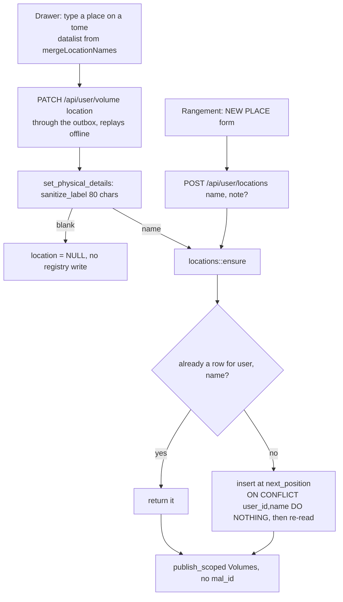
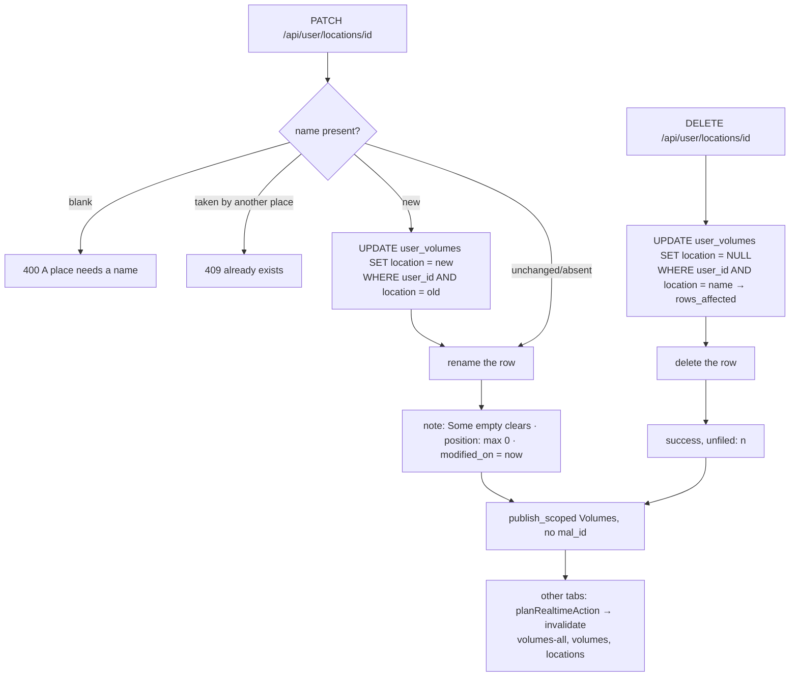
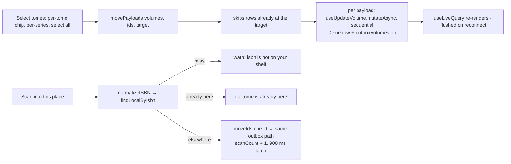

# Places: the storage registry · 棚

> Where a tome physically lives — a shelf, a box, a room. The tome
> points at its place **by name** (`user_volumes.location`), which is
> what the offline cache and the archive bundle already carry; the
> `locations` table adds what a bare string cannot — a note, a display
> order and an identity, so a whole shelf can be renamed or emptied in
> one move. `services/locations.rs` keeps the two in step: a place typed
> on a tome registers itself, a rename cascades onto its tomes, a delete
> unfiles them. The `/rangement` page reads entirely from the cached
> rows and moves tomes through the outbox, so a box can be re-filed in a
> basement with no signal. Used by every signed-in user.

## Mental model

**The pointer is the name, not an id.** `user_volumes.location` is free
text and stays free text. No foreign key, no join, no migration of
existing rows — which is exactly why a place survives in the Dexie
mirror, in an archive bundle and in an outbox payload without any of
them knowing the registry exists. A tome can point at a name that has no
registry row; that is a degraded state, not an error.

**Typing a place registers it.** `set_physical_details` calls
`locations::ensure` whenever a `location` rides on the volume PATCH, so
the registry fills itself from ordinary use. `ensure` is idempotent and
race-safe: it looks the name up, inserts with `ON CONFLICT (user_id,
name) DO NOTHING`, then looks it up again — the unique index arbitrates.

**Rename cascades, delete unfiles.** `update` with a new `name` first
rewrites every `user_volumes.location` that matched the old one, then
renames the row; `remove` sets those `location`s to `NULL` and returns
how many, then deletes the row. Deleting a place never deletes a tome.

**Counts are never stored.** The server derives them with one grouped
scan of the user's *owned* volumes (`list`), and the client derives its
own from `db.volumes` (`groupByLocation`) — so they are right offline
too. `cacheLocations` deliberately drops the server's `volumes` field.

**Moving tomes is offline work; curating places is not.** A move is an
ordinary volume PATCH through `enqueueVolumeUpdate`, so it queues and
replays. Creating, renaming, annotating, reordering and deleting a place
are plain `axios` calls with no outbox — the Rangement page disables
exactly those controls when offline and says so.

## Data

`locations` — `20260914100000_locations.sql`:

| Column | Meaning |
|---|---|
| `id BIGSERIAL PRIMARY KEY` | The identity a bare name lacks. |
| `user_id INTEGER NOT NULL REFERENCES users(id) ON DELETE CASCADE` | The registry is per user; account deletion takes it. |
| `name VARCHAR(80) NOT NULL` | **Exactly** the string stored on `user_volumes.location`. |
| `note TEXT` | A reminder ("top shelf, behind the lamp"), trimmed, `NULL` when blank, cut at `NOTE_MAX_CHARS` = 500 characters. |
| `position INTEGER NOT NULL DEFAULT 0` | Display order, 0-based; ties break on name. New places get `max(position) + 1`. |
| `created_on`, `modified_on TIMESTAMPTZ NOT NULL DEFAULT now()` | |

`UNIQUE (user_id, name)` is the whole consistency story, and what makes
`ensure` safe to race. Indexes: `idx_locations_user_position (user_id,
position, name)` for the listing, `idx_user_volumes_user_location
(user_id, location) WHERE location IS NOT NULL` for the counting scan.
The migration backfilled one row per distinct name already typed on a
tome, ordered by when that name first appeared
(`ROW_NUMBER() OVER (PARTITION BY user_id ORDER BY MIN(created_on),
location) - 1`, `ON CONFLICT DO NOTHING`).

`user_volumes.location` — `20260913140000_volume_physical_details.sql` —
is `TEXT NULL` with no database-side length check; the 80-character cap
is application-side (`models/volume.rs::LOCATION_MAX_LEN`, applied by
`sanitize_label`, empty folding to `NULL`).

Wire shapes (`server/src/services/locations.rs`,
`handlers/locations.rs`):

```
LocationView      { id, name, note, position, volumes, created_on, modified_on }
LocationsResponse { locations: LocationView[], unfiled }   // unfiled = owned tomes with no place
CreateLocationRequest { name, note? }
LocationPatch     { name?, note?, position? }              // note: "" clears; a missing field is left alone
DELETE response   { success: true, unfiled: <rows unfiled> }
```

Archive (`server/src/models/archive.rs`, `ExportBundle` v2):
`locations: ExportLocation[]` where `ExportLocation = { name, note?,
position }` — no ids, because they are per instance. Each
`ExportVolume.location` still carries its own string; the two are
reconciled on import.

Client (Dexie, `client/src/lib/db.js`, schema **v17**): the `locations`
store (`id, name`) mirrors `GET /api/user/locations` through
`cacheLocations`, which clears and bulk-puts `{ id, name, note, position
}` only. There is no `outboxLocations` table — registry writes are
online-only.

## Flows

A place comes into existence:



Rename, reorder, delete:



Filing tomes from `/rangement` — the offline half:



## Endpoints

All four under the session-guarded `/api/user` nest
(`server/src/routes/api.rs`); each mutation publishes `SyncKind::Volumes`
**unscoped** (`mal_id: None`) with the caller's client id.

| Method | Path | Handler fn | Service fn | Notes |
|---|---|---|---|---|
| GET | `/api/user/locations` | `locations::list` | `locations::list` | Every place in `position, name` order with its `volumes` count, plus `unfiled` — both from one grouped scan of the user's **owned** volumes, whose keys are trimmed before bucketing. `[]` and `0` when empty. |
| POST | `/api/user/locations` | `locations::create` | `locations::create` | Body `{name, note?}`. Idempotent: an existing place is returned rather than duplicated, and the note is written only when it differs. A blank name is a 400 (`"A place needs a name."`). Returns the row. |
| PATCH | `/api/user/locations/{id}` | `locations::update` | `locations::update` | Body `LocationPatch`. A changed `name` **rewrites every tome filed under the old one** before renaming the row; blank → 400, already taken → 409. `note: ""` clears, `position` is floored at 0, `modified_on` is always bumped. 404 for another user's id. |
| DELETE | `/api/user/locations/{id}` | `locations::remove` | `locations::remove` | Unfiles the tomes (`location = NULL`) and deletes the row; answers `{success, unfiled}`. The tomes are otherwise untouched. 404 for another user's id. |

`PATCH /api/user/volume` is the fifth writer: its `location` field is
what registers a place in the first place (see `docs/modules/scan.md`
for the rest of the physical-copy patch).

## Client

- `lib/locations.js` — pure, and the only place the grouping rules live.
  `UNFILED = "__unfiled__"` is a UI sentinel, never a real name.
  `normalizeLocationName` is a trim. `groupByLocation(volumes, library)`
  → `{ places: Map<name, group>, unfiled: group }` over **owned** tomes
  only, each group `{ name, count, series: [{ mal_id, name,
  image_url_jpg, tomes }] }` with series sorted by name and tomes by
  number. `listPlaces(registry, groups)` returns the registry rows in
  their order, then appends any name that exists only on tomes — those
  carry `id: null`, which is the flag everything downstream keys off.
  `mergeLocationNames(registry, volumes)` is the datalist source
  (registry order first, then the extras alphabetically, deduplicated).
  `movePayloads(volumes, ids, location)` builds the outbox payloads
  `{ id, mal_id, vol_num, owned, price, store, collector, location }`,
  **skipping every row already at the target** — so the "n tomes moved"
  figure counts real changes, not the selection.
- `hooks/useLocations.js` — `useLocations()` reads `db.locations` live
  (sorted by `position`, then name) and refreshes from
  `GET /api/user/locations` into `cacheLocations`, through the shared
  `deriveListState` ladder. `useLocationMutations()` is plain
  `axios.post` / `patch` / `delete`, each invalidating `["locations"]`,
  `["volumes-all"]` and `["volumes"]` on success — a rename or a delete
  moved rows on the server that this client never saw.
- `components/RangementPage.jsx` (`/rangement`, `ProtectedRoute`, lazy)
  — a two-column master/detail on one screen, not two views: the left
  column lists the "unfiled" pseudo-row, then `listPlaces`, then the new
  place form; the right column is the selected place. `selected` holds a
  **name** (or `UNFILED`, or `null`). Each `PlaceRow` is a
  view / edit / confirm tri-state — no `window.confirm` — and its
  rename, note, delete and the ↑ ↓ reorder arrows are disabled offline
  (reordering is two `position` PATCHes, and the arrows do not appear at
  all for an unregistered place). The detail pane offers per-tome and
  per-series selection, a target `<select>` of every other place plus
  "unfiled", the move button, "Scan into this place", "Count this
  place", "Labels" and "Box label". Only the registry controls are
  gated on `useOnline`; selecting, moving, scanning, counting and
  printing are not.
- The same page is the hub for the two neighbouring modules: labels via
  `tomeLabels(...)` with the place forced as the third line, or one
  `boxLabel` whose lines summarise the place ("One Piece · T.1–12 (12)",
  capped at 8 lines); and the stock-take via
  `navigate("/inventaire", { state: { scope: selected === UNFILED ?
  { kind: "all" } : { kind: "place", name: selected } } })`. Both in
  `docs/modules/scan.md`.
- `components/VolumeDetailDrawer.jsx` — the per-tome `location` input,
  with a `<datalist>` built by `mergeLocationNames` over `db.locations`
  and `db.volumes` read together, so suggestions work offline and
  include names that were never registered.
- `components/CollectionPage.jsx` — a "places" headline stat
  (`registry?.length`), rendered only when non-zero and linking to
  `/rangement`.
- `components/InventoryPage.jsx` — its place picker unions the registry
  names with every non-blank `location` on a cached volume, for the same
  reason.

## Invariants & gotchas

- **The name is the join.** Nothing enforces that a
  `user_volumes.location` has a registry row, or that a registry row has
  any tomes. Both halves are designed for it: `list` reports a place
  with `volumes: 0`, and `listPlaces` surfaces an unregistered name with
  `id: null`.
- **Renaming an unregistered place diverges.** In `RangementPage`, a row
  with `id == null` has no id to PATCH, so "rename" calls
  `create.mutateAsync({ name: patch.name … })` — which registers a row
  under the **new** name while the tomes keep pointing at the old one.
  The page then optimistically re-selects the new name. Registering the
  place first (or moving the tomes) is the way round it.
- **Deleting an unregistered place is a move.** Same branch: with no id,
  the page unfiles the tomes through the outbox instead of calling the
  API — which is the one "delete" that works offline.
- **Neither cascade is transactional.** `update` rewrites the tomes and
  then renames the row on the plain connection (`&state.db`, no `begin`);
  `remove` unfiles and then deletes the same way. A failure between the
  two halves leaves tomes on a name whose row still says the old one (or
  an orphan row with nothing in it). Reordering is likewise two separate
  PATCHes swapping `position`.
- **A place is only as long as `sanitize_label` allows.** `ensure`,
  `create` and `update` all clamp to `LOCATION_MAX_LEN` = 80 before
  touching `locations.name` (`VARCHAR(80)`), but the **archive importer
  writes `ExportVolume.location` onto the tome verbatim** — no trim, no
  clamp. A bundle carrying a longer or untrimmed name therefore lands a
  `user_volumes.location` that `ensure_all_from_volumes` can only
  register in truncated form, and the two no longer match: the place
  shows `volumes: 0` on the server (its counting key is the full trimmed
  string) and is not counted as `unfiled` either. `groupByLocation`
  still surfaces it client-side, as an extra.
- **Counts are owned-only, on both sides.** A tome you do not own has no
  place as far as the listing is concerned, even when `location` is set.
  Server-side the grouping key is trimmed, so `"  Étagère A  "` counts
  under `"Étagère A"`; `groupByLocation` trims identically.
- **`unfiled` is a number, not a place.** `UNFILED` exists only in the
  client; there is no row, no id, and no `{kind:"place"}` scope for it —
  the Rangement page hands `{ kind: "all" }` to the stock-take from that
  bucket, and hides the box-label button there.
- **Realtime is coarse on purpose.** Registry writes publish `Volumes`
  with **no** `mal_id`, so `planRealtimeAction` falls to the
  `invalidate` branch and `KIND_TO_KEYS.volumes` —
  `[["volumes-all"], ["volumes"], ["locations"]]` — refreshes the
  registry on every other tab. A *tome* move publishes `Volumes` scoped
  to its series, which takes the `refresh` branch and never invalidates
  `["locations"]`; that is harmless, because the counts are derived from
  the volume rows that refresh brings in. The originating tab is skipped
  by `origin` in both cases.
- **The archive carries places twice** — as `ExportLocation` rows and as
  a string on each volume — and reconciles them on the way in:
  `import_rows` (merge fills only what is missing: a new place, a blank
  note; replace takes the bundle's note and position as truth) then
  `ensure_all_from_volumes`, so a bundle older than the registry still
  ends with one row per place. Both run **only on a live import**,
  inside the transaction, immediately before `COMMIT` — a `dry_run`
  never touches the registry. Details in `docs/modules/archive.md`.
- **Account deletion** takes the registry through `user_id ON DELETE
  CASCADE`; nothing in `users::delete_account` mentions the table.
- **`cacheLocations` drops the counts.** The Dexie row keeps only `id`,
  `name`, `note` and `position` — anything showing a number must derive
  it from `db.volumes`, or it will be stale offline.

## Where it lives

| File | Role |
|---|---|
| `server/src/services/locations.rs` | `NOTE_MAX_CHARS`, `clean_note`, `find_by_name`, `find_owned`, `next_position`, `ensure`, `list`, `create`, `update`, `remove`, `all_for_export`, `import_rows`, `ensure_all_from_volumes`, `LocationView`, `LocationsResponse`, `LocationPatch` |
| `server/src/handlers/locations.rs` | The four endpoints, `CreateLocationRequest`, the `publish_scoped(Volumes, None, client_id)` after each write |
| `server/src/routes/api.rs` | `/locations` and `/locations/{id}` inside the `/user` nest |
| `server/src/models/location.rs` | The entity; `name` documented as "exactly the string stored on `user_volumes.location`" |
| `server/src/models/volume.rs` | `location`, `LOCATION_MAX_LEN`, `PhysicalPatch.location` |
| `server/src/models/library.rs` | `sanitize_label` — the trim/clamp both sides of the pointer share |
| `server/src/services/volume.rs` | `set_physical_details` — the `ensure` call that registers a typed place |
| `server/src/services/archive.rs`, `models/archive.rs` | `all_for_export` / `import_rows` / `ensure_all_from_volumes` call sites; `ExportLocation` |
| `server/migrations/20260914100000_locations.sql` | Table, both indexes, the backfill |
| `server/migrations/20260913140000_volume_physical_details.sql` | `user_volumes.location` itself |
| `client/src/lib/locations.js` | `UNFILED`, `normalizeLocationName`, `groupByLocation`, `listPlaces`, `mergeLocationNames`, `movePayloads` |
| `client/src/hooks/useLocations.js` | Dexie-first read, the three online-only mutations and their invalidations |
| `client/src/components/RangementPage.jsx` | `/rangement`: places list, detail, multi-select move, scan-into-place, labels, inventory hand-off |
| `client/src/components/VolumeDetailDrawer.jsx` | The per-tome location input and its `<datalist>` |
| `client/src/components/CollectionPage.jsx`, `InventoryPage.jsx` | The "places" headline stat; the place scope picker |
| `client/src/lib/db.js` | Dexie v17 `locations` store, `cacheLocations` |
| `client/src/lib/realtimePlan.js`, `lib/sync/outbox.js` | `KIND_TO_KEYS.volumes` including `["locations"]`; `location` in `PHYSICAL_KEYS` |
| `client/src/i18n/{en,fr,es}.js` → `rangement.*` | "Where things live", "Scan into this place", "Count this place", … |
| `scripts/verify-archive-roundtrip.mjs` | Registers a place from a tome, annotates it, adds a second, and diffs the registry through export / import |

## Tests & verification

Server (`cargo test locations`): `services/locations.rs::tests` — one
test, `notes_are_trimmed_cleared_and_capped` (`None` and whitespace
become `None`, surrounding space is trimmed, a long note is cut to
`NOTE_MAX_CHARS` counted in characters). `ensure`, the rename cascade,
the delete unfile, `list`'s counting and `import_rows` have **no** unit
tests; the database path is only covered by the script below.

Client (`pnpm test`): `lib/locations.test.js` (4) — `groupByLocation`
groups owned tomes by *trimmed* place then by series, sorted, with the
blank-location tome landing in `unfiled` and the unowned one dropped;
`listPlaces` keeps the registry order and appends names known only from
tomes; `mergeLocationNames` lists registry names first, then extras
alphabetically, no duplicates; `movePayloads` emits a payload only for
the tome that actually moves and carries `price` / `store` through,
accepting either an array or a `Set` and `null` for "unfile".
`useLocations`, `useLocationMutations` and `RangementPage` are not
covered.

Local stack (`docs/test-stack.md`): with the stack up and seeded,
`node scripts/verify-archive-roundtrip.mjs` types `"Étagère A"` on two
tomes and `"Carton grenier"` on a third, asserts the first registered
itself from the tomes alone (`GET /api/user/locations`), PATCHes a note
and `position: 0` onto it, and POSTs the second — which returns the row
the tome already created and only adds the note. All of it then travels
through a fresh-account merge and a same-account replace, the registry
compared as `name|note|position` tuples in both directions, failing on a
dropped row or a changed count. By hand: open `/rangement`, create a
place, then select a few tome chips and move them into it with DevTools
set to Offline — there is no drag-and-drop, the move is a selection plus
the "move to" picker. The move queues and the grid updates immediately
while the registry controls grey out ("Places are edited online — moving
tomes works offline"); go back online and watch the outbox drain. Renaming a place from a second tab
shows up in the first on its next websocket frame, and its tomes follow.
