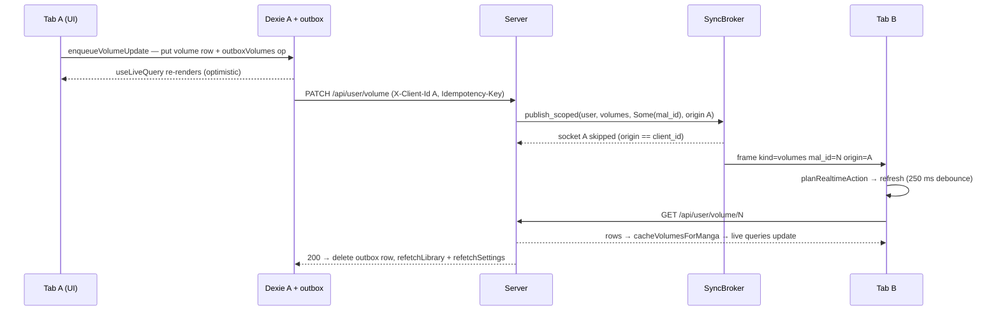
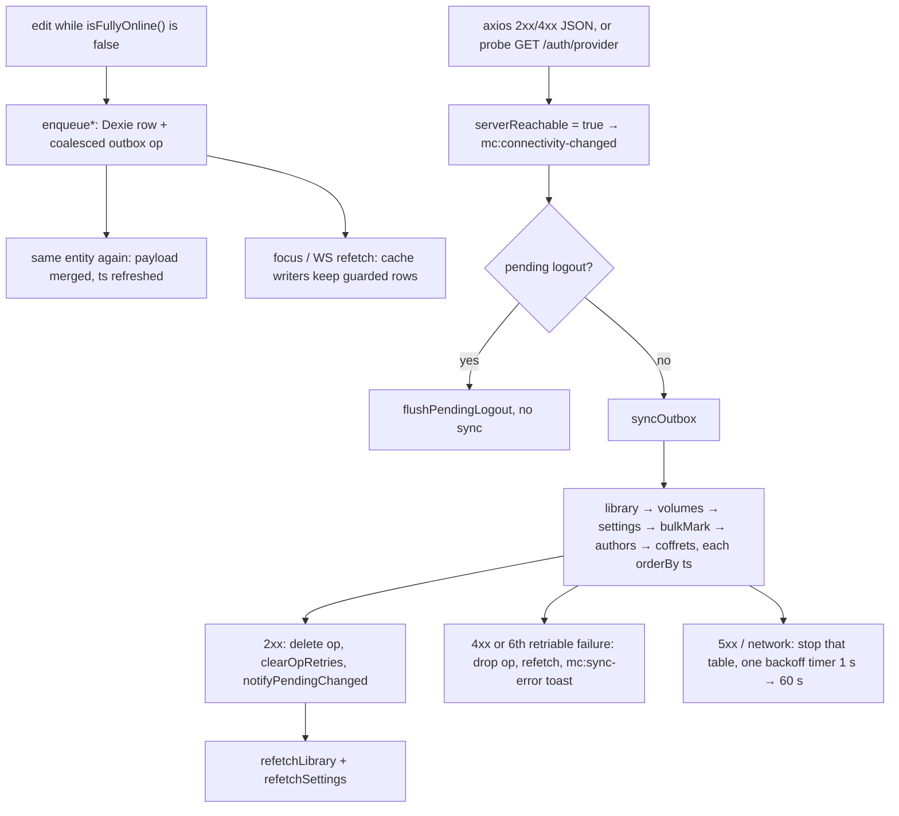
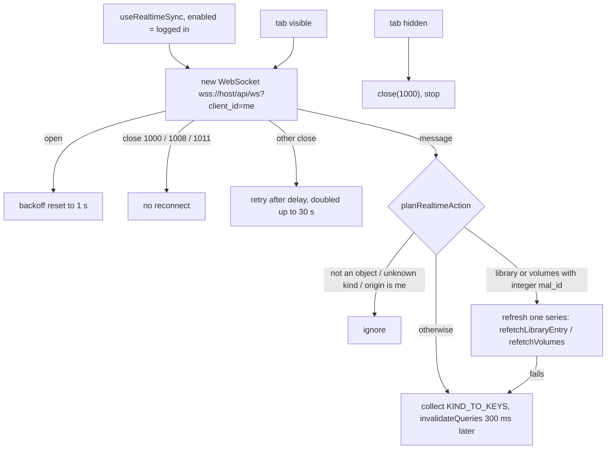

# Realtime & offline sync · 同

> How an edit made on one device shows up on every other one, and how the app keeps reading and
> writing while the server is unreachable. Covers the Dexie mirror and outbox in `client/src/lib/`,
> the connectivity watcher, the invalidation WebSocket at `/api/ws` (`SyncBroker` on the server,
> `useRealtimeSync` on the client) and the server-side activity coalescer on the same mutation path.

## Mental model

**Dexie is what the UI renders.** Every list and card reads IndexedDB through `useLiveQuery` (`db.library`,
`db.volumes`, `db.settings`, …). React Query never feeds a component directly: each `queryFn` fetches from the API
and writes the response into Dexie through a `cache*` writer (`useLibrary` → `cacheLibrary`, `useVolumesForManga` →
`cacheVolumesForManga`, `useSettings` → `cacheSettings`). The query cache is a refresh coordinator (`staleTime` 5 min,
`refetchOnWindowFocus`, `networkMode: "offlineFirst"`), not a data source, which is why it is not persisted.

**Writes go to Dexie first, then to an outbox.** An `enqueue*` call in `lib/sync/outbox.js` updates
the mirror row and upserts one coalesced op per entity into the matching `outbox*` table, in a single
Dexie transaction — the outbox stores the desired final state, not a log of edits. `syncOutbox()`
replays those tables when `isFullyOnline()`, in a fixed table order and chronologically within each
table. The cache writers know about the outbox: a row with a pending op outranks any server snapshot,
so a focus refetch or a websocket refresh cannot revert an unsynced edit.

**The WebSocket carries invalidations, never data.** A mutation handler publishes
`SyncEvent { user_id, kind, mal_id?, origin? }` on the `SyncBroker`; every socket of that user
receives it except the one whose request caused it. The receiving tab either refreshes the one series
named by `mal_id` into Dexie or invalidates the React Query keys mapped from `kind`; the usual refetch
machinery does the rest. Adding a column to a row never changes the protocol.

**Devices and tabs are peers.** Each tab owns one socket and one client id (`sessionStorage`), sends it on every
request (`X-Client-Id`) and on the upgrade (`?client_id=`), and hears every other tab's changes — including the other
tabs of the same browser. Backend instances share events through Redis pub/sub when `REDIS_URL` is set.

## Data

### Dexie (`client/src/lib/db.js`, database `mangacollector`, schema v16)

Every `db.version(n).stores({…})` restates the full table list (a Dexie requirement). The history is additive
except v7, and no `.upgrade()` data transforms exist, so a version bump never rewrites or drops outbox rows.

| Table | Indexes | Role | Since |
|---|---|---|---|
| `library` | `mal_id, name` | mirror of `GET /api/user/library` | v1 |
| `volumes` | `id, mal_id, vol_num, isbn, [mal_id+vol_num]` | mirror of the volume rows (`isbn` index: v16) | v1 |
| `settings`, `seals`, `streak`, `friendsList` | `key` (single row `"user"`) | mirrors | v1, v6, v9, v15 |
| `outboxLibrary` | `mal_id, ts` | pending series ops | v1 |
| `outboxVolumes` | `id, mal_id, ts` | pending per-volume ops (`mal_id` index added in v3 for the delete cascade) | v1 |
| `outboxSettings` | `key` | pending settings op | v1 |
| `outboxBulkMark` | `mal_id, ts` | pending bulk owned/read cascade | v8 |
| `outboxAuthors` | `mal_id, ts` | pending custom-author patch/delete | v10 |
| `outboxCoffrets` | `id, mal_id, ts` | pending box-set create/update/delete | v14 |
| `authors`, `coffrets`, `snapshots`, `activity`, `calendarUpcoming`, `volumeCoverMaps`, `isbnCache`, `malRecommendations`, `mangaCharacters` | see file | read caches; snapshots, activity, calendar and cover maps have no outbox | v2–v13 |

v7 drops a short-lived `outboxTags` table by declaring it `null`. `clearAllUserData()` (logout,
account deletion, 401 session loss) clears every table via `db.tables` — pending ops included — plus
the Workbox caches, the query cache and the `mc:auth-user` localStorage key.

### Outbox records (as written by `lib/sync/outbox.js`)

```
outboxLibrary  { mal_id, op: "upsert"|"delete"|"owned"|"patch", payload?, ts }
outboxVolumes  { id, mal_id, op: "update",
                 payload: { owned, price, store, collector, read?, notes?, loan?,
                            condition?, location?, extra_copies?, bought_at?, isbn? }, ts }
outboxSettings { key: "user", payload: { currency, titleType, adult_content_level, theme, language,
                 avatarUrl, sound_enabled, accent_color, shelf_3d_enabled, ink_trail_enabled }, ts }
outboxBulkMark { mal_id, owned?, read?, ts }
outboxAuthors  { mal_id, op: "patch"|"delete", payload: { name?, about? } | null, ts }
outboxCoffrets { id, mal_id, op: "create"|"update"|"delete", payload | null, ts }
```

`ts` is `Date.now()` at the last (re-)enqueue; a coalesced re-edit refreshes it. A coffret `id` is the server PK,
or `-Date.now()` for a row minted offline (re-keyed with its bound volumes when the `create` flushes).
`PHYSICAL_KEYS = ["condition", "location", "extra_copies", "bought_at", "isbn"]` are merged field by field and
only sent when defined. The header comment in `db.js` still lists an `update-owned` op; the code writes `owned` and `patch`.

### Websocket message (`server/src/services/realtime.rs::SyncEvent`)

```json
{"user_id":7,"kind":"volumes","mal_id":42,"origin":"3dd0b814-23f4-4342-b13f-d5f0dd7d4ca6"}
{"user_id":7,"kind":"library"}
```

`kind` is one of `library | volumes | coffrets | settings | seals | activity | authors | snapshots |
friends`. `mal_id` and `origin` are `serde(default, skip_serializing_if = None)`: absent when unknown,
and a bare `{user_id, kind}` frame from a previous build still decodes during a rolling deploy.
Server → client only; the client never sends application frames (the read half absorbs control frames).

### Client id (`client/src/lib/clientId.js`)

`crypto.randomUUID()` (or 24 base36 characters) stored under `sessionStorage["mc:client-id"]` — per
tab by design. Sent as `X-Client-Id` by the axios request interceptor (`utils/axios.js`) and as
`?client_id=` on the upgrade. The server's `ClientId` extractor (`handlers/realtime.rs`) accepts
`[A-Za-z0-9_-]{8,64}` and yields `None` otherwise; it is only ever used for echo suppression.

## Flows

### 1 · Online edit, two devices



### 2 · Offline edits, reconnect, replay



### 3 · Socket lifecycle and the realtimePlan decision



## Endpoints & messages

| Route | Auth | Direction / body | Where |
|---|---|---|---|
| `GET /api/ws?client_id=<id>` | session cookie (`AuthenticatedUser`; anonymous → 401) | upgrade; server → client text frames of `SyncEvent`; server pings every 30 s and closes after 60 s without an inbound frame | `handlers/realtime.rs` |
| `GET /auth/provider` | none | connectivity probe, 5 s timeout, must answer JSON | `lib/connectivity.js` |
| `GET /api/user/library`, `GET /api/user/library/{mal_id}` (`Vec` of 0..1), `GET /api/user/volume`, `GET /api/user/volume/{mal_id}`, `GET /api/user/settings` | session | refetch paths that refill Dexie | `outbox.js`, hooks |
| `POST /api/user/library`, `PATCH /api/user/library/{mal_id}`, `PATCH /api/user/library/{mal_id}/{owned}`, `DELETE /api/user/library/{mal_id}`, `PATCH /api/user/storage/poster/{mal_id}` | session | replayed by `flushLibrary` | `handlers/library.rs` |
| `PATCH /api/user/volume` | session | `flushVolumes`; `read`, `notes`, `loan` and physical fields only when set | `handlers/volume.rs` |
| `POST /api/user/settings` | session | `flushSettings` | `handlers/settings.rs` |
| `POST /api/user/library/{mal_id}/volumes/bulk-mark` | session | `flushBulkMark`, body `{ owned?, read? }` | `handlers/library.rs` |
| `PATCH` / `DELETE /api/authors/{mal_id}` | session | `flushAuthors` | `handlers/author.rs` |
| `POST /api/user/library/{mal_id}/coffrets`, `PATCH` / `DELETE /api/user/coffrets/{id}` | session | `flushCoffrets` | `handlers/coffret.rs` |

Publish sites by kind: `library`, `volumes` and `coffrets` come from `handlers/{library,volume,coffret}.rs` through
`publish_scoped` with the series id and the caller's client id. `authors`, `snapshots`, `friends`, `settings` and the
compare-page copy use the unscoped `publish` (no origin, so they echo back to the caller); the nightly upcoming sweep
(`services/jobs.rs`) publishes an unscoped `volumes` per affected user. **No server path publishes `activity` or
`seals` today** — the variants and client key mappings exist, but those lists only refresh through React Query's own
stale/focus cycle, and `SealsUnlockToaster` reacts to `library` / `volumes` / `coffrets` events instead.

Every replayed write carries `Idempotency-Key: <table>:<pk>:<ts>`. The server allow-lists the header in
CORS and does not read it yet.

## Client

- `hooks/useRealtimeSync.js` — the only socket owner, mounted once in `App.jsx` with `enabled: Boolean(googleUser)`.
  Backoff 1 s → 30 s, reset on `open`; a hidden tab closes the socket (`1000`) and stops, a visible one reopens. A
  stale socket's late `close` cannot schedule a second reconnect (identity guard). Scoped events debounce 250 ms per
  `kind:mal_id` and re-run once if another lands mid-flight; unscoped keys are batched and invalidated 300 ms after
  the burst starts. Every accepted frame is also re-broadcast on `window` as `mc:sync-event`.
- `lib/realtimePlan.js` — pure decision table. `KIND_TO_KEYS` is frozen (`volumes` → `["volumes-all"]` + the
  `["volumes"]` prefix; `coffrets` also touches `["volumes-all"]`; `settings` also `["user-profile"]`); `SCOPED_KINDS =
  {library, volumes}`; `Object.hasOwn` keeps a `__proto__` kind out; own-echo needs both `origin` and `myClientId` as strings.
- `lib/sync/outbox.js` — the `enqueue*` family, the six `flush*`, `refetchLibrary` / `refetchLibraryEntry` /
  `refetchVolumes` / `refetchSettings`, `syncOutbox({ force })`, `triggerSync`, `forceResyncFromServer`.
- `lib/sync/runner.js` — `installSyncRunner()`: connectivity-recover hook (a pending logout is flushed
  first, then no sync), a 60 s interval on visible tabs with pending work, `visibilitychange`, and a
  deferred startup pass via `requestIdleCallback`. Singleton-guarded against StrictMode's double mount.
- `lib/sync/events.js` — `mc:pending-changed` (→ `usePendingCount`, `OfflineBanner`), `mc:sync-error` /
  `mc:sync-info` (→ `SyncToaster`), `mc:sync-event` (→ `SealsUnlockToaster`).
- `lib/connectivity.js` — `isFullyOnline() = navigator.onLine && serverReachable`, `probeServer()`, and
  `installConnectivityWatcher()`: an axios response interceptor plus adaptive polling (120 s up, 10 s down).
  A `200 text/html` counts as *down* — it is the SPA fallback, not the API. `useOnline()` exposes the state.
- Where invalidation is wired: in `useRealtimeSync` (from events) and inside the outbox refetch helpers
  (`refetchLibrary` → `["library"]`, `refetchVolumes` → `["volumes", mal_id]`, `refetchSettings` → `["settings"]`).
  Mutations that go through the outbox do **not** invalidate. `useUpdateVolume` (`hooks/useVolumes.js`) documents
  why: the optimistic Dexie write already drives every consumer through `useLiveQuery`, and an invalidation would
  refetch *before* the PATCH has been applied, so `cacheVolumesForManga` (delete-then-bulkPut) would overwrite the
  optimistic row with stale server data — the reported bug that later led to the outbox-aware writers. Online-only
  mutations (`useStartReread`, the upcoming-volume CRUD) write the server response into Dexie themselves.

## Invariants & gotchas

- **One pending op per entity.** Same key → payload merge (`enqueueVolumeUpdate` keeps fields the new patch
  did not mention; `enqueueLibraryPatch` keeps an in-flight `upsert` as `upsert`). A `delete` is terminal —
  except coffret `create` + `delete`, which cancels both without touching the server, and author `delete` +
  `patch`, which becomes a `patch` (the server then 404s and the row is reconciled from `GET /api/authors/{mal_id}`).
- **Delete cascade.** `enqueueLibraryDelete` removes the local series and its volumes, drops that series'
  pending `outboxVolumes` and `outboxBulkMark` rows (they would 404 after the server cascade) and replaces
  any pending `upsert` with `delete`.
- **Ordering.** Chronological by `ts` *within* a table. Across tables the order is fixed — library,
  volumes, settings, bulk-mark, authors, coffrets — for dependency reasons (a library PATCH creates the
  free-text author the author PATCH then edits; bound volumes must exist before a coffret POST), not by
  timestamp. Each table's flush is isolated: a retriable failure stops that table and the others still run.
- **Server snapshot vs outbox.** `cacheLibrary`, `cacheLibraryEntry`, `dropCachedLibraryEntry`, `cacheVolumesForManga`,
  `cacheAllVolumes`, `cacheSettings`, `cacheAuthor`, `cacheCoffretsForManga`: a pending `delete` means the row is not
  resurrected; any other pending op means the local row survives; a pending bulk-mark guards every volume of the
  series *and* its library row. With an empty outbox they degrade to plain replace-all. `cacheSnapshots`,
  `cacheStreak`, the calendar and cover-map writers are plain (nothing queues behind them).
- **Own echo.** Skipped server-side when the event carries the caller's `origin`, and again client-side in
  `planRealtimeAction`. Events published with the plain `publish()` have no origin and do come back to the caller —
  one harmless extra invalidation. A tab without a valid client id gets the old broadcast-to-everyone behaviour.
- **Errors.** 4xx → drop, refetch, toast. 5xx / network → keep and retry under a single growing timer (1 s → 60 s; other
  triggers are no-ops until it fires; `force` bypasses). After `MAX_OP_RETRIES = 6` retriable failures on one stable key
  (`library:<mal_id>`, `volume:<id>`, …) the op is dead-lettered like a 4xx. The budget is in memory — a reload resets it.
- **Socket auth and limits.** The upgrade is a plain `GET`: it passes the CSRF origin guard (GET/HEAD/OPTIONS
  are exempt), is counted by `tower_governor` like any other request when `RATE_LIMIT_ENABLED`, and needs
  the session cookie. The hook's header comment says a 401 means "stop trying", but the `close` handler only
  stops on codes 1000 / 1008 / 1011 — a refused upgrade is retried with backoff while the tab is visible.
- **Broker.** `tokio::sync::broadcast` with a 256-event buffer; the forwarding loop is
  `while let Ok(event) = rx.recv()`, so a socket that falls more than 256 events behind stops being served
  and has to reconnect. With Redis, publishes go through channel `mc:sync` only and are re-injected locally
  by the subscriber loop (reconnects every 2 s); a failed Redis publish falls back to the in-process channel.
- **Activity coalescer** (`services/activity_coalescer.rs`, `AppState.activity`, 5 s window): `volume_owned` ↔
  `volume_unowned` (keyed user, mal_id, vol_num) and `series_added` ↔ `series_removed` (user, mal_id) cancel each
  other inside the window; a surviving entry lands with its original `created_on`. It runs on the same mutation path
  as the realtime publish but publishes nothing itself; the feed catches up on its next refetch.
- **Schema bumps** add tables and indexes only; the outbox survives a deploy. Logout and
  `forceResyncFromServer()` (Settings → restore from server) discard all six outbox tables on purpose.
- `emitSyncEvent` forwards a `payload` field the current server never sets.

## Where it lives

| File | Role |
|---|---|
| `server/src/handlers/realtime.rs` | `ws_handler`, `ClientId` extractor, per-socket send / ping / recv tasks, own-echo skip |
| `server/src/services/realtime.rs` | `SyncKind`, `SyncEvent`, `SyncBroker` (in-memory or Redis `mc:sync`) |
| `server/src/routes/api.rs` | mounts `GET /api/ws` (outside the `/user` nest) |
| `server/src/main.rs` | picks the broker from `REDIS_URL`; CORS allow-list for `x-client-id`, `idempotency-key` |
| `server/src/handlers/{library,volume,coffret}.rs` | `publish_scoped(user, kind, Some(mal_id), client_id)` after each mutation |
| `server/src/services/activity_coalescer.rs` | 5 s compensating-pair buffer for the activity feed |
| `client/src/lib/db.js` | Dexie schema v1–v16, outbox-aware `cache*` writers, `clearAllUserData` |
| `client/src/lib/sync/outbox.js` | enqueue / flush / refetch / backoff / dead-letter / force resync |
| `client/src/lib/sync/runner.js` | background flush triggers, pending-logout ordering |
| `client/src/lib/sync/events.js`, `client/src/lib/sync.js` | the `mc:*` window events; barrel re-export |
| `client/src/lib/connectivity.js` | reachability state, probe, axios interceptor, polling |
| `client/src/lib/clientId.js`, `client/src/lib/realtimePlan.js` | per-tab id in `sessionStorage`; `KIND_TO_KEYS`, `planRealtimeAction` |
| `client/src/lib/queryClient.js` | React Query defaults (`offlineFirst`, 5 min stale, no 4xx retry); cleared on `mc:session-lost` |
| `client/src/hooks/useRealtimeSync.js` | socket lifecycle, debounced refresh / invalidation |
| `client/src/hooks/useVolumes.js`, `useLibrary.js`, `useSettings.js` | fetch → `cache*`, outbox-backed mutations |
| `client/src/utils/axios.js` | `X-Client-Id` request interceptor, 401 session-loss flow |
| `client/src/hooks/usePendingCount.js`, `useOnline.js`, `components/OfflineBanner.jsx`, `SyncToaster.jsx`, `SealsUnlockToaster.jsx` | status hooks and UI subscribers |

## Tests & verification

**Rust** — `cd server && cargo test realtime` and `cargo test activity_coalescer` (9 tests):
- `services/realtime.rs::wire_tests` — the wire shape: both optional fields serialise, are omitted (not
  `null`) when absent, an old `{user_id, kind}` frame still decodes, negative custom ids round-trip.
- `handlers/realtime.rs::client_id_tests` — `ClientId::sanitize` accepts the UUID and base36 shapes,
  rejects short / long / foreign characters, inclusive 8..=64 bounds.
- `services/activity_coalescer.rs::tests` — `classify` pairs only. The timing behaviour (cancel within
  5 s, original timestamp kept) has no test.

**Vitest** — `cd client && pnpm test -- src/lib/sync src/lib/db.test.js src/lib/realtimePlan.test.js
src/lib/clientId.test.js src/lib/connectivity.test.js`:
- `lib/sync/outbox.test.js` — runs Dexie against `fake-indexeddb/auto` with connectivity mocked offline, so the queue
  is observed exactly as the flusher would find it: one op per entity, payload merging, patch normalisation, the volume
  merge and loan rules, the delete cascade, and `refetchLibraryEntry` (empty array or 404 → drop; guarded rows kept).
- `lib/db.test.js` — the cache writers against pending ops, ending with the end-to-end race: an offline
  edit survives a focus refetch, a self-echo refetch and the post-flush refetch.
- `lib/realtimePlan.test.js`, `lib/clientId.test.js`, `lib/sync/events.test.js`, `lib/connectivity.test.js`
  — the decision table, the id contract, the four event channels, the probe and content-type rules.
- Not covered: the `useRealtimeSync` hook (no socket test), `runner.js`, the `syncOutbox` flush loop, Redis.

**By hand on the local test stack** (`docs/test-stack.md`; the Vite proxy forwards `/api` with `ws: true`): log in
as the same username in two tabs — each gets its own client id — and toggle a volume in one. The other tab's grid
updates without a reload, and DevTools → Network → WS shows the `{"kind":"volumes","mal_id":…}` frame arriving only
in the *other* tab. Switch DevTools to Offline, edit a few volumes and a series, watch `OfflineBanner`'s pending
count; go back online and it drains in table order. The server logs `Realtime sync: in-memory (single-instance
deploys)` at boot unless `REDIS_URL` is set; rate limiting is off in `server/test-stack.env`.
