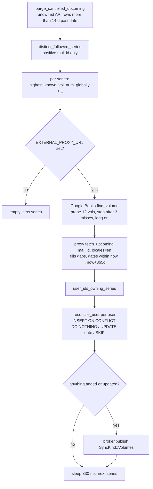
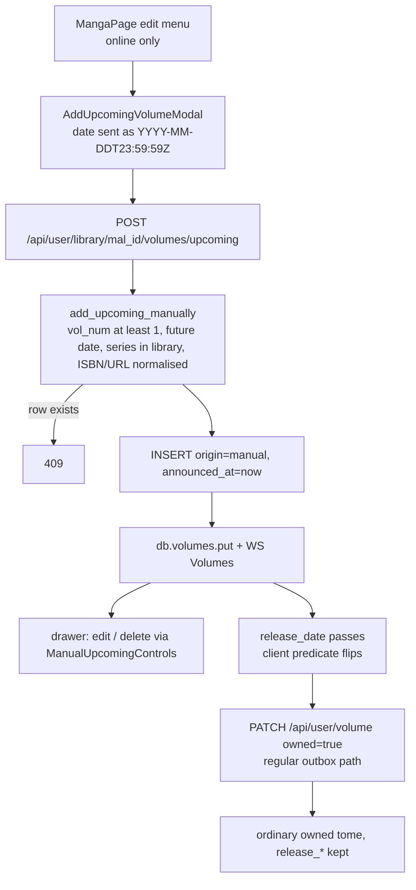
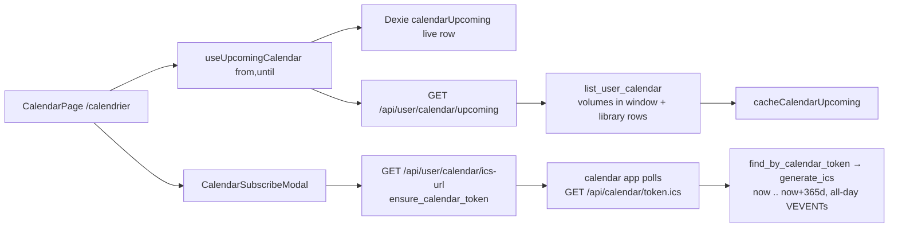

# Releases · 来

> Tracks tomes that are announced but not yet on the shelf. An upcoming
> volume is an ordinary `user_volumes` row with a `release_date` in the
> future: the nightly sweep discovers them (Google Books in-process, plus
> the optional release-calendar proxy), users pencil their own, and the
> same rows feed the `/calendrier` page, a subscribable ICS feed and the
> "releases this month" badge in the navigation. Used by every signed-in
> user; the ICS feed is the one anonymous surface.

## Mental model

There is no separate table, flag or status enum. A row is *upcoming* iff
`release_date > now()`; the moment the timestamp passes it is a plain
missing volume, with no job or migration involved. While upcoming, the
server forces `owned = false`, `collector = false`, `read_at = NULL`
(`coerce_upcoming_flags` in `services/volume.rs`, applied silently on
`PATCH /api/user/volume` so a replayed outbox entry cannot jam the sync),
`bulk-mark` skips the row and `set_loan` refuses it. The client mirrors
the predicate in `Volume.jsx` and `VolumeShelfTile.jsx`.

`origin` records who wrote the row. `manual` means the user typed it and
is sticky: the sweep never updates or purges it, and it is the only
origin the edit/delete endpoints accept. `googlebooks` comes from the
in-process Google Books probe; `editor`, `ann` and `mangaupdates` come
from the proxy (`proxy_source_to_origin` collapses every publisher
scraper into `editor`). The entity and migration comments also list
`openlibrary` and `mangadex`; nothing writes those today.

Discovery is a cascade in `releases::discover_upcoming_with_locale`,
gated on `EXTERNAL_PROXY_URL`: unset or empty, it returns an empty list
without calling anything, Google Books included. Manual pencilling, the
calendar page, the ICS feed and the badge all work without a proxy.

A release becomes an owned tome the ordinary way: once the date has
passed the drawer offers the usual owned/read toggles and the user
PATCHes the row. An API-origin row that is still unowned 14 days after
its date is treated as cancelled and deleted by the next sweep
(`purge_cancelled_upcoming`). The calendar lists every row with a
non-null `release_date` inside a month window, joined with the series
name, cover and genres from `user_library`.

## Data

`user_volumes` (migration `20260427100000_add_volume_release.sql`):

| Column | Meaning |
|---|---|
| `release_date TIMESTAMPTZ` | Announced date, UTC. `> now()` = upcoming; `NULL` = released or unknown. Manual rows are stored at `23:59:59Z` of the chosen day, Google Books hits at `00:00:00Z`. |
| `release_isbn TEXT` | ISBN of the announced edition. Manual path keeps 10 or 13 chars after stripping separators (trailing `X` allowed); API path stores what the source returned (ISBN-13 preferred). Distinct from `isbn`, the scanned copy. |
| `release_url TEXT` | Pre-order link. `http(s)://` only — 400 on the manual path, silently dropped on the sweep path (`sanitize_release_url`). |
| `origin TEXT NOT NULL DEFAULT 'manual'` | `manual` / `googlebooks` / `editor` / `ann` / `mangaupdates`. |
| `announced_at TIMESTAMPTZ` | When this server first stored the announcement; bumped when the sweep moves the date. Shown as freshness in the drawer for API rows only. |

Indexes: `user_volumes_upcoming_idx (user_id, release_date) WHERE
release_date IS NOT NULL` covers the calendar query;
`uniq_user_volumes_user_mal_vol (user_id, mal_id, vol_num) WHERE mal_id
IS NOT NULL` (`20260424160000_unique_library_volumes.sql`) is what keeps
the sweep and the user from minting the same tome twice.

`users.calendar_token TEXT` (`20260427120000_add_user_calendar_token.sql`):
nullable, UUID v4 minted lazily, partial unique index
`users_calendar_token_uniq`. The token is the only credential of the ICS
feed.

Client (Dexie, `client/src/lib/db.js`): the `volumes` store
(`id, mal_id, vol_num, isbn, [mal_id+vol_num]`) holds every volume row
including the release columns and feeds the badge, the dashboard tab and
sort, the shelf and the drawer. `calendarUpcoming` (`key, ts`, schema
v11) caches one `/api/user/calendar/upcoming` response per range under
`${from}__${until}` (or `_default`), no eviction, wiped with every table
on logout. Server-side, `CacheStore` (Redis, optional) holds Google Books
answers under `gbooks:vol:{title_lc}:{vol}:{lang}` — hits 7 days, misses
24 h.

## Flows

Nightly discovery (`services/jobs.rs::nightly_upcoming_sweep`, spawned in
`main.rs`; first tick 30 min after boot, then every 24 h):

Manual pencilling and graduation to an owned tome:

Calendar and ICS read path:

## Endpoints

All under the session-guarded `/api/user` nest except the feed itself.
Route table: `server/src/routes/api.rs`.

| Method | Path | Handler fn | Service fn | Notes |
|---|---|---|---|---|
| POST | `/api/user/library/{mal_id}/refresh-upcoming` | `library::refresh_upcoming` | `releases::discover_upcoming_with_locale` + `reconcile_user` | Per-user `start_vol`, locale from `settings.language` (`en`/`fr`/`es`). Returns `{success, added, updated, skipped, discovered_count}`; scoped WS `Volumes` only when something changed. Client hides it for `mal_id < 0`. |
| POST | `/api/user/library/{mal_id}/volumes/upcoming` | `volume::add_upcoming_volume` | `volume::add_upcoming_manually` | Body `{vol_num, release_date, release_isbn?, release_url?}`. 400 past date / bad ISBN / bad URL, 404 series not in library, 409 tome exists. Works for custom series. |
| PATCH | `/api/user/volumes/{id}/upcoming` | `volume::update_upcoming_volume` | `volume::update_upcoming_manually` | Same body without `vol_num`; only `release_*` change. 409 unless `origin = manual`. |
| DELETE | `/api/user/volumes/{id}` | `volume::delete_volume` | `volume::delete_manual_volume` | 409 unless `origin = manual` (the sweep would resurrect an API row). |
| GET | `/api/user/calendar/upcoming?from=YYYY-MM&until=YYYY-MM` | `calendar::list_upcoming` | `releases::list_user_calendar` | Defaults: first of the current month → end of the month 360 days ahead, UTC. 400 if `until < from`. `{from, until, releases: CalendarEntry[]}`. |
| GET | `/api/user/calendar/ics-url` | `calendar::get_ics_url` | `users::ensure_calendar_token` | Mints on first call, idempotent after. `{url, webcal_url, token}`, `url = FRONTEND_URL/api/calendar/{token}.ics`. |
| POST | `/api/user/calendar/ics-url/regenerate` | `calendar::regenerate_ics_url` | `users::regenerate_calendar_token` | New UUID; the old URL 404s on the subscriber's next poll. |
| GET | `/api/calendar/{token}.ics` | `calendar::ics_feed_by_token` | `users::find_by_calendar_token` + `calendar_ics::generate_ics` | Public, mounted outside `/user`. 404 for any unknown token. `text/calendar`, `Cache-Control: private, max-age=3600`, `X-Robots-Tag: noindex`. |

## Client

- Route `/calendrier` in `App.jsx` (lazy `CalendarPage`, behind
  `ProtectedRoute`); nav entries in `Header.jsx` (top and bottom bars),
  `CommandPalette.jsx`, a `WelcomeTour.jsx` step and a key in
  `hooks/useGlobalShortcuts.js`.
- `components/CalendarPage.jsx` — Agenda (default) and Month-grid views,
  choice persisted in `localStorage["mc:calendar-view"]`; window is the
  current month plus 6 or 12 months; text filter on `manga_name`; a card
  navigates to the MangaPage with `state.openVolumeId`. `parseReleaseDate`
  reads the `YYYY-MM-DD` prefix into a local date so the day never shifts
  with the viewer's timezone.
- `hooks/useUpcomingCalendar.js` — Dexie live row for the range plus
  React Query `["calendar-upcoming", from, until]` (`staleTime` 60 s),
  mirrored into `calendarUpcoming`; exposes `source: "cache" | "live"`.
- `components/CalendarSubscribeModal.jsx` — lazy GET of the ICS URL,
  copy, `webcal://` link, Google Calendar add-by-URL, regenerate with an
  in-flow confirm. The toolbar button is disabled offline.
- `components/AddUpcomingVolumeModal.jsx` — create/edit form used by
  `MangaPage.jsx` (create; menu item disabled offline, offered on custom
  series too) and by the drawer (edit). Hooks in `hooks/useVolumes.js`:
  `useAddUpcomingVolume`, `useUpdateUpcomingVolume`,
  `useDeleteUpcomingVolume` — plain mutations, no outbox, each writes the
  server's row into `db.volumes` directly.
- `components/VolumeDetailDrawer.jsx` — upcoming panel with origin,
  freshness (`announced_at`, API rows only), ISBN and pre-order link;
  `ManualUpcomingControls` (edit/delete) only when `origin === "manual"`.
- `utils/user.js::refreshUpcoming` — POSTs `refresh-upcoming`; MangaPage
  turns the report into a `notifySyncInfo` toast (`op: "upcoming-refresh"`).
- `Dashboard.jsx` — "upcoming" tab filter and `nextUpcomingByMal` (soonest
  tome per series) for the cards (`Manga.jsx`) and the `upcoming` sort key
  in `utils/librarySort.js`. `utils/libraryStats.js` excludes upcoming rows
  from the doubles count.
- `hooks/useNavCounters.js` + `lib/navCounters.js` —
  `countReleasesThisMonth(db.volumes)`: `release_date` strictly after now
  and before the first of next month, local time. Rendered by `NavBadge`
  in the Header. No request behind it.
- `lib/scanLookup.js` — a scanned barcode is matched against `isbn` and
  `release_isbn`, so picking up an announced tome finds the existing row.

Offline: everything read from `db.volumes` (badge, dashboard, shelf,
drawer) and any previously visited calendar range keep working. Network
required for `refresh-upcoming`, manual add/edit/delete and the ICS URL.
Marking a released tome owned uses the regular volume PATCH and its
outbox. WebSocket `volumes` events refetch `["volumes-all"]` and
`["volumes"]` (`lib/realtimePlan.js`) but not `["calendar-upcoming"]`;
the calendar page converges on its own refetch.

## Invariants & gotchas

- `release_date > now()` is the single definition of "upcoming", on both
  sides. Never add a parallel flag.
- Duplicates: the sweep inserts with `ON CONFLICT (user_id, mal_id,
  vol_num) DO NOTHING` and must restate the partial predicate via
  `target_and_where(mal_id IS NOT NULL)`, or Postgres rejects the clause.
  On Postgres a `DO NOTHING` conflict surfaces as
  `DbErr::RecordNotInserted`, counted as *skipped*, not as an error.
  `add_volume_tx` swallows the same conflict when the user bumps a
  series' volume count while the sweep races it. The manual path
  pre-checks and returns 409.
- `origin = 'manual'` protects a row from the sweep's UPDATE, from the
  purge, and is the only origin PATCH/DELETE `…/upcoming` accept. A sweep
  UPDATE changes `release_date`, `announced_at`, `modified_on` only; ISBN,
  URL and origin are never rewritten once a row exists. Owned,
  already-released and unchanged rows are skipped.
- The purge deletes *every* unowned non-manual row more than 14 days past
  its date — a legitimately released tome the user never marked owned
  goes with the cancelled ones.
- `reconcile_user` and `add_upcoming_manually` both refuse a series the
  user does not have in `user_library`; `list_user_calendar` silently
  drops rows whose library entry is gone.
- Feature gate: `EXTERNAL_PROXY_URL` (trimmed, empty = unset) enables the
  whole cascade; `GOOGLE_BOOKS_API_KEY` only raises the Google quota.
  Neither appears in `server/.env.example` or `server/test-stack.env`.
- External calls: the proxy call times out after
  `EXTERNAL_PROXY_TIMEOUT_SECS` (default 150; the field doc in
  `config.rs` still says 90) and any failure yields an empty list, never
  an error. Google Books non-2xx → `Ok(None)`, not cached; hits cached
  7 d, misses 24 h; probe depth 12, stop after 3 consecutive misses (the
  module header says two). `langRestrict` receives the 2-letter settings
  code although the `find_volume` doc says 3-letter. Sweep pacing is
  330 ms between series, locale hard-coded to `en`; per-user refresh uses
  the user's language and their own highest volume.
- Dates: Google Books `YYYY-MM` is accepted as the 1st, `YYYY` rejected.
  The JSON window starts at the first of the current month, so this
  month's already-shipped tomes still appear; the ICS window starts at
  `now`. ICS dates are `VALUE=DATE` in UTC with `DTEND` = next day;
  UIDs `mc-vol-{user}-{mal}-{vol}@mangacollector` are stable so a moved
  date updates the event instead of duplicating it. Vitest pins
  `TZ=UTC` in `client/src/test/setup.js`; tests build instants with
  `Date.UTC`.
- The ICS token is the credential: a leaked URL exposes the feed until
  regenerated. The public route is mounted on the api router, outside the
  session-guarded nest, on purpose.
- Route names: edit/delete live under the plural `/volumes/{id}` because
  Axum rejects `/volume/{id}` next to `/volume/{mal_id}`. The doc comment
  in `handlers/volume.rs` says `/volume/{id}/upcoming`; the route table
  is authoritative.
- The module header of `services/releases.rs` still describes a
  "MangaUpdates only" cascade; the code is Google Books plus proxy.
- The archive bundle carries all five columns; `origin: None` on import
  keeps the DB default `manual`. Any new release column must be added to
  the bundle (`scripts/verify-archive-roundtrip.mjs` fails otherwise).

## Where it lives

| File | Role |
|---|---|
| `server/src/services/releases.rs` | Discovery cascade, `reconcile_user`, `list_user_calendar`, sweep helpers, purge |
| `server/src/services/jobs.rs` | `nightly_upcoming_sweep` loop (spawned from `main.rs`) |
| `server/src/services/google_books_api.rs` | Tier 1 source: `find_volume`, title matching, date/ISBN parsing, cache |
| `server/src/services/proxy_client.rs` | Tier 2 source: `fetch_upcoming` against `/v1/upcoming` |
| `server/src/services/calendar_ics.rs` | RFC 5545 generator (`generate_ics`) |
| `server/src/services/volume.rs` | Manual add/update/delete, ISBN/URL normalisers, upcoming guards, bulk-mark filter |
| `server/src/services/users.rs` | Calendar token lifecycle |
| `server/src/handlers/calendar.rs` | JSON window, ICS URL, public feed |
| `server/src/handlers/volume.rs` | `UpcomingVolumeRequest`, manual endpoints |
| `server/src/handlers/library.rs` | `refresh_upcoming` |
| `server/src/routes/api.rs` | Route table |
| `server/src/config.rs` | `EXTERNAL_PROXY_URL`, `EXTERNAL_PROXY_TIMEOUT_SECS`, `GOOGLE_BOOKS_API_KEY` |
| `server/src/models/volume.rs`, `models/user.rs` | Entities (`release_*`, `origin`, `announced_at`; `calendar_token`) |
| `server/migrations/20260427100000_add_volume_release.sql`, `…120000_add_user_calendar_token.sql`, `20260424160000_unique_library_volumes.sql` | Schema |
| `client/src/components/CalendarPage.jsx`, `CalendarSubscribeModal.jsx`, `AddUpcomingVolumeModal.jsx` | Pages and modals |
| `client/src/components/VolumeDetailDrawer.jsx`, `Volume.jsx`, `VolumeShelfTile.jsx`, `MangaPage.jsx`, `Dashboard.jsx`, `Header.jsx` | Upcoming rendering, refresh menu, tab/sort, badge |
| `client/src/hooks/useUpcomingCalendar.js`, `useVolumes.js`, `useNavCounters.js` | Data hooks |
| `client/src/lib/db.js`, `navCounters.js`, `realtimePlan.js`, `scanLookup.js` | Dexie cache, badge maths, WS plan, ISBN match |
| `client/src/utils/user.js`, `librarySort.js`, `libraryStats.js` | `refreshUpcoming`, sort key, stats exclusion |
| `docs/release-calendar-proxy.md` | Proxy protocol, caching, deadlines, locales |
| `scripts/verify-archive-roundtrip.mjs` | Pencils an upcoming volume and checks it survives export/import |

## Tests & verification

Server (`cargo test`): `services/google_books_api.rs` (English and French
title matching, wrong-volume and `Vol 1`/`Vol 10` rejection, `YYYY-MM-DD`
/ `YYYY-MM` / `YYYY` parsing, ISBN-13 preference); `services/proxy_client.rs`
(percent-encoding, empty result when no id is given); `models/archive.rs`
(a v1 bundle deserialises with `release_date`/`origin` = `None`,
`release_isbn` round-trips). `reconcile_user`, the purge, `generate_ics`
and the `YYYY-MM` window parsing in `handlers/calendar.rs` have no unit
tests today.

Client (`pnpm test`): `lib/navCounters.test.js` (`countReleasesThisMonth`),
`utils/user.test.js` (`refreshUpcoming` URL, including negative ids),
`utils/librarySort.test.js` (`upcoming` sort key), `utils/libraryStats.test.js`
(doubles ignore upcoming rows), `lib/scanLookup.test.js` (`release_isbn`
match). `useUpcomingCalendar`, `CalendarPage` and the two modals are not
covered.

Local stack (`docs/test-stack.md`): start it, seed with
`node scripts/seed-test-stack.mjs`, pencil a tome from a MangaPage edit
menu — calendar, badge and ICS feed need no proxy; copy the URL from the
subscribe modal and `curl` it to read the VCALENDAR. To exercise
discovery, export `EXTERNAL_PROXY_URL` (optionally `GOOGLE_BOOKS_API_KEY`)
before `cargo run`, then use the "refresh upcoming" menu item or
`POST /api/user/library/{mal_id}/refresh-upcoming`; the nightly job only
fires 30 minutes after boot. `node scripts/verify-archive-roundtrip.mjs`
proves the release columns survive export/import.
