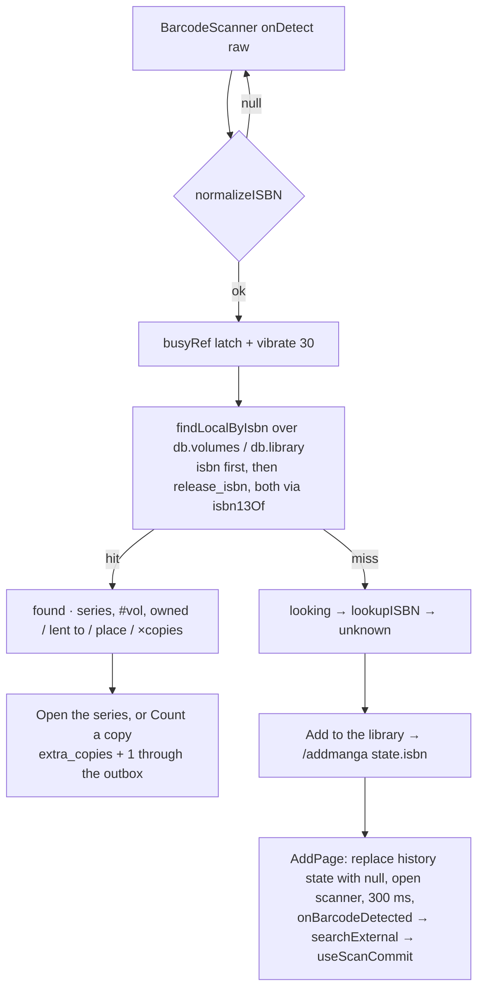
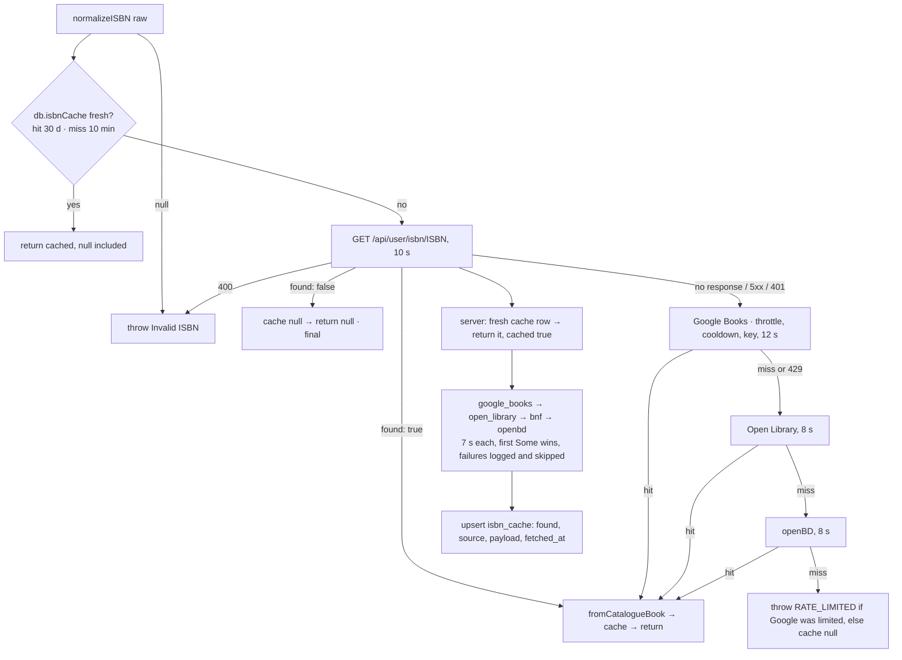
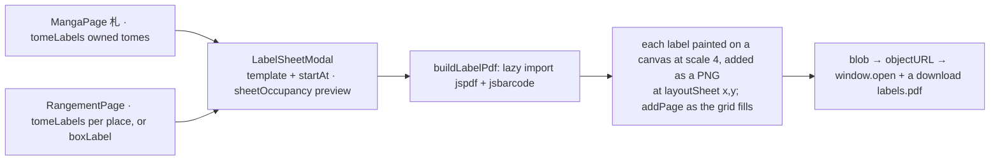

# Barcodes: scanning, ISBN, inventory, labels · 番

> Everything that starts with the number printed under a barcode. The
> camera decodes an EAN-13 (`lib/barcode.js`), the shelf is asked first
> (`lib/scanLookup.js`, against Dexie), and only a miss reaches the
> catalogues — the server's four-source chain
> (`services/isbn_resolver.rs`, cached instance-wide in `isbn_cache`) or
> the browser's own CORS-friendly fallback when the server is
> unreachable. The same number is stored per tome (`user_volumes.isbn`),
> is what a stock-take ticks off (`/inventaire`) and what a printed
> label carries back (`lib/labels.js`). Used by every signed-in user;
> the camera itself never needs a server.

## Mental model

**The camera is just a text input.** `startScan(video, onDetect)` fires
`onDetect(rawValue)` and knows nothing else — no ISBN validation, no
deduplication, no UI. Every consumer (`ScanPage`, `AddPage`,
`RangementPage`, `InventoryPage`) mounts the same `BarcodeScanner`,
re-validates with `normalizeISBN` and debounces with its own `busyRef`
latch. The manual-entry tray routes through the *same* `onDetect`, so a
typed number and a scanned one are indistinguishable downstream.

**The shelf answers before any catalogue.** `findLocalByIsbn` matches
the barcode against the cached volume rows — `isbn` first, then an
announced tome's `release_isbn` — so "is this already mine?" costs no
request and works offline. Only a miss pays for a lookup.

**One chain, two ends.** `lookupISBN` walks Dexie → the server → the
browser's own catalogues. The server leg is the normal one: one shared
cache and four sources for the whole instance. The direct leg exists for
the case the server itself is down; a server answer of "nobody knows
this barcode" is *final* and never falls through.

**The 13-digit form is the currency.** An EAN-13 scan yields it, an
ISBN-10 converts to it losslessly, and both sides store and compare
nothing else — `normalize_isbn13` on the server, `isbn13Of` on the
client. `normalizeISBN` only validates and strips separators.

**Counting and printing are client-only.** The stock-take session lives
in `localStorage`, its lists derive from `db.volumes`, and the label PDF
is built in the browser. Neither has an endpoint, neither is server
state, neither travels in the archive.

## Data

`user_volumes.isbn` — `20260913150000_volume_isbn_and_isbn_cache.sql`:
`VARCHAR(13) NULL`, the ISBN of *this copy's* edition as scanned or
typed, distinct from `release_isbn` (the announced tome, see
`docs/modules/releases.md`). Index `user_volumes_user_isbn_idx (user_id,
isbn) WHERE isbn IS NOT NULL`. Written only by
`services/volume.rs::set_physical_details` — the `isbn` leg of
`PhysicalPatch`, three-state (omitted / `null` or `""` clears / a value
that must normalise or the PATCH is a 400) — and by the archive
importer, which runs the bundle value through `normalize_isbn13`.

`isbn_cache` — same migration, one row per ISBN ever resolved **by the
instance, whatever the user**: `isbn VARCHAR(13) PRIMARY KEY`, `found`
(misses are cached too), `source` (`google_books` / `open_library` /
`bnf` / `openbd`, `NULL` for a miss), `payload` (the `IsbnBook` as JSON,
`NULL` for a miss) and `fetched_at`, against which `cache_is_fresh`
allows 30 days for a hit and 1 day for a miss. No `user_id`, no FK, no
eviction: the catalogues answer the same for everyone.

```
IsbnBook       { isbn, title, subtitle?, authors[], publisher?, published?,
                 page_count?, language?, cover?, description?,
                 price?: { amount, currency }, source }
ResolveOutcome { isbn, found, book: IsbnBook|null, source: string|null, cached }
```

`fromCatalogueBook` re-shapes that into `{ isbn, rawTitle, title,
volume, authors, publisher, edition, pageCount, thumbnail, description,
language, price, source }` — `title` / `volume` split out by
`parseTitleVolume` (nine patterns: `Vol.`, `tome`, `t.`, `book`, `part`,
`第n巻`, `n巻`, `#n`, a trailing number, over input clamped to 500
characters), `edition` sniffed by `detectEditionFromTitle`.

Client caches (`client/src/lib/db.js`): `isbnCache` (`isbn, ts`, Dexie
v2) holds `{ isbn, result, ts }`, `result: null` being a cached miss —
30 days for a hit, 10 minutes for a miss, no eviction, wiped with every
table on logout. The `volumes` store carries `isbn` as a field *and* an
index (v16), which is what makes the shelf lookup cheap.

Inventory session — `localStorage["mc.inventory.v1"]`, written by
`saveSession`, read once at mount by `loadSession` (which accepts a blob
only when `expected` is an array and `seen` is present):

```
{ scope: {kind:"all"} | {kind:"series", mal_id} | {kind:"place", name},
  expected: number[],            // volume ids: the owned rows of the scope
  seen: { [volumeId]: ISOdate },
  unknown: string[],             // barcodes no tome carries
  outside: [{ id, isbn }],       // on the shelf, but not in this scope
  startedAt, finishedAt }
```

Labels are `{ title, line2?, line3?, barcode? }` for a tome and
`{ title, lines[] }` for a box. Five presets in `LABEL_TEMPLATES`
(`avery-l7160` 3×7, `avery-l7163` 2×7, `avery-l7651` 5×13 on A4;
`avery-5160` 3×10, `avery-5163` 2×5 on Letter), all in millimetres.

## Flows

Scan to find — `/scan`, `components/ScanPage.jsx`:



ISBN resolution — `lib/isbn.js::lookupISBN`, then
`services/isbn_resolver.rs::resolve`:



Label sheet — `lib/labels.js` + `components/LabelSheetModal.jsx`:



## Endpoints

One server endpoint, plus the volume PATCH that stores the number. The
three direct catalogue calls are browser → third party.

| Method | Path | Handler fn | Service fn | Notes |
|---|---|---|---|---|
| GET | `/api/user/isbn/{isbn}` | `isbn::lookup` | `isbn_resolver::resolve` | Session-guarded, so the shared cache cannot be filled anonymously. The path is normalised with `normalize_isbn13`: malformed is a 400, unknown is a **200 with `found: false`**. Returns `ResolveOutcome`; `cached: true` means it never left the box. |
| PATCH | `/api/user/volume` | `volume::update_volume` | `volume::set_physical_details` | `isbn` rides on the ordinary volume PATCH (outbox-replayed). `""` / `null` clears; anything not a valid ISBN-10/13 is a 400. Publishes `Volumes` scoped to the series. |
| GET | `www.googleapis.com/books/v1/volumes?q=isbn:…` | — | `isbn.js::lookupGoogleDirect` | Browser-direct, fallback only, 12 s. `referrerPolicy: "no-referrer"` so an API key in the query string does not ride the `Referer`. 429 → `RATE_LIMITED` + cooldown. |
| GET | `openlibrary.org/search.json`, `api.openbd.jp/v1/get` | — | `lookupOpenLibraryDirect`, `lookupOpenBdDirect` | Browser-direct, fallback only, 8 s each. |

Server-side the four catalogues go through `state.http_client`
(`connect_timeout` 5 s, `timeout` 30 s, at most 2 redirects) under a
per-source `tokio::time::timeout` of 7 s — the binding deadline. BnF
(`catalogue.bnf.fr/api/SRU`, SRU 1.2 + Dublin Core) is server-only: it
sends no CORS headers.

## Client

- `lib/barcode.js` — `startScan(video, onDetect)`, `FORMATS =
  ["ean_13", "ean_8", "upc_a"]`. Native `window.BarcodeDetector` is
  preferred and probed through `getSupportedFormats()` (some browsers
  expose the constructor and stub the format API); otherwise
  `await import("barcode-detector/pure")` pulls the ZXing-WASM polyfill,
  lazily, so a supporting browser never downloads it. The loop reads the
  video only at `readyState >= 2`, takes `codes[0].rawValue`, swallows
  decode errors and re-arms every 120 ms (~8 reads/s).
- `components/BarcodeScanner.jsx` — full-screen portal into
  `document.body`, so no ancestor `isolate`/transform traps it under the
  header. Props `onDetect`, `onClose`, `statusMessage`,
  `recentCount = 0`; `getUserMedia` asks `facingMode: environment` at
  1280×720, no audio. Four states drive the pill and the bottom card:
  `requesting`, `running`, `denied` (`NotAllowedError` /
  `SecurityError` / `PermissionDeniedError`) and `failed`
  (`NotFoundError`, or any other error with its message shown).
  `ManualIsbnTray` (手入力) slides over the live feed,
  `inputMode="numeric"`, tolerates separators while typing, normalises
  at submit, flips its accent rule hanko → moegi once the value
  validates, and calls the same `onDetect`; Esc dismisses it, else
  closes the scanner. When the camera is `denied` or `failed`, manual
  entry becomes the full-width primary action.
- `lib/isbn.js` — the whole ISBN surface (`normalizeISBN`, `isbn13Of`,
  `lookupISBN`, `parseTitleVolume`, `detectCoffret`, `searchExternal`)
  plus the Google-quota machinery: a 600 ms minimum gap, an adaptive
  cooldown (60 s × 2^(n−1), capped at 10 min) and an optional key in
  `localStorage["mc:google-books-key"]`.
  `lib/scanLookup.js::findLocalByIsbn(volumes, library, rawIsbn)` →
  `{ volume, series, matchedOn }` or `null`; pure, `series` may be null.
- `components/ScanPage.jsx` (`/scan`, `ProtectedRoute`, lazy; a
  permanent button in `Header.jsx`) — `found` / `looking` / `unknown` in
  a portal card over the camera. "Count a copy" PATCHes
  `extra_copies + 1` through `useUpdateVolume`, i.e. the outbox;
  "Add to the library" navigates to `/addmanga` with `state.isbn`.
  `AddPage.jsx` is the other end: a mount effect reads that state,
  replaces the history entry with `state: null` (so Back does not replay
  it), opens the scanner and calls `onBarcodeDetected` after 300 ms.
  `hooks/useScanCommit.js` then commits — add the series if missing,
  bump `volumes` if the scanned number exceeds it, mark each target
  owned — writing `isbn` **only on the tome actually scanned**, never on
  the gap-filled ones. `VolumeDetailDrawer.jsx` carries the manual ISBN
  field, validated live into `aria-invalid`.
- `components/InventoryPage.jsx` (`/inventaire`) + `lib/inventory.js` —
  phases `scope` → `scan` → `lists` → `done`. `location.state.scope` is
  read **only as the lazy initial value** of the three scope fields: it
  pre-fills the form, never auto-starts a count. `buildSession`
  snapshots the *owned* rows of the scope as `expected`; `applyScan`
  returns `present` / `repeat` / `outside` / `unknown` / `invalid`,
  vibrating `30` for a tick and `[20, 40, 20]` otherwise behind a 700 ms
  latch; `toggleSeen` ticks by hand (missing and present lists only);
  `summarize` splits `present` / `missing` / `lent` — a missing tome out
  on loan is set apart, not blamed — plus `unknown` and `outside`. A
  portalled HUD over the camera carries the scope, a `present / total`
  bar and the last outcome; closing the scanner moves to `lists`, it
  does not finish. "Finish" stamps `finishedAt` and puts `missingCsv`
  behind a plain `<a download="inventory-missing.csv">`, offered only
  when something is missing or lent. Every write goes through `persist`
  → `localStorage`; a `repeat` or an `invalid` writes nothing.
- `lib/labels.js` — pure geometry, EAN-13, label builders and text
  fitting; no DOM, no app imports, all tested. Only `buildLabelPdf`
  touches the DOM: it `import()`s `jspdf` and `jsbarcode` on first use
  and paints **each label on an offscreen canvas** at `scale = 4`
  (≈384 dpi) before placing it as a PNG — bitmaps rather than jsPDF
  text, because the built-in fonts are Latin-1 only and canvas draws
  through the system font stack, so kanji, kana and Hangul print.
- `components/LabelSheetModal.jsx` (`{open, onClose, labels, title,
  subtitle}`) treats `labels` as opaque and never re-derives a label's
  contents: the tome word and the third line are the *caller's* choice,
  and there is no page-size picker (the page belongs to the template).
  It owns the template `<select>`, the "start at position" field
  (clamped to `0 … perPage−1`, also settable by clicking a preview
  cell), a preview of **sheet 1** coloured from `sheetOccupancy`, and
  the `summarizeLabels` line. "Generate PDF" builds the blob,
  best-effort `window.open`s it and always exposes an
  `<a download="labels.pdf">`; there is no `window.print()`. Mounted
  lazily from `MangaPage.jsx` (owned tomes, `line3` = the tome's place)
  and `RangementPage.jsx` (every tome of a place, or one box label).

Offline: the camera, the shelf lookup, the stock-take and the label PDF
all work with no network — `jspdf` / `jsbarcode` are `.js` chunks, so
the VitePWA `globPatterns` precache them with the shell. `lookupISBN`
needs a network (the Dexie cache aside), and adding a scanned tome is
online-only: volume ids are server-generated.

## Invariants & gotchas

- **`normalizeISBN` does not convert.** It returns the cleaned 10- or
  13-digit input; `isbn13Of` produces the comparable form. A comparison
  written against `normalizeISBN` silently fails to match an ISBN-10
  against the ISBN-13 stored on the row.
- **A server "not found" is final.** `lookupViaServer` returns `null`
  for `found: false` and `undefined` only for a transport failure (no
  response, a 5xx, a 401 on a box that lost its session); only
  `undefined` falls through. That `null` is cached for 10 minutes
  client-side and 1 day server-side.
- **The direct fallback is mostly blocked in production.** The CSP in
  `client/nginx.conf` allows `connect-src … https://www.googleapis.com`
  but names neither `https://openlibrary.org` nor
  `https://api.openbd.jp`, so behind the shipped nginx only the Google
  Books leg of the browser fallback can run; the other two are refused
  by the browser and land in `.catch(() => null)`, reading as an honest
  miss. Likewise `img-src` covers `books.google.com` and
  `covers.openlibrary.org` but not `cover.openbd.jp`, so a Japanese
  cover the *server* resolved through openBD will not render. The Vite
  dev server sets no CSP, which is why this does not show up locally.
  Adding a source to either chain means adding its host here too.
- **Quota state is per tab and in memory** (`lastCallAt`,
  `cooldownUntil`, `consecutive429` are module-level in `isbn.js`): a
  reload resets it and a second tab has its own budget. `setApiKey`
  clears the cooldown on purpose — the request now carries identity.
- **The cache is instance-wide, not per user.** `isbn_cache` has no
  `user_id` and no FK; the endpoint is session-guarded purely so
  anonymous traffic cannot fill it. Nothing prunes it.
- **Four sources, first answer wins, failures are silent.** A source
  that errors or exceeds 7 s is logged at `warn` and skipped; only when
  all four come back empty is a miss written. `parse_bnf` treats
  `numberOfRecords = 0` as an honest miss, cleans `"Oda, Eiichiro
  (1975-....). Auteur du texte"` down to the name and reads a page count
  out of `"1 vol. (192 p.) …"`. Covers become `https://`; BnF has none.
- **`isbn` vs `release_isbn`.** The first is the copy in hand, the
  second the announced edition. `findLocalByIsbn` and `tomeLabels` both
  prefer the copy and fall back to the announcement; a tome carrying a
  broken `isbn` gets the *release* barcode on its label rather than an
  unreadable one, because `ean13Of` refuses a bad check digit.
- **One detection per scanner mount.** `firedRef` latches inside
  `BarcodeScanner`; continuous scanning (Rangement, Inventory) works
  only because those parents keep it mounted and re-arm their own
  `busyRef` after 900 ms / 700 ms — any new consumer must bring its own
  latch. The buzz calls `navigator.vibrate` directly rather than
  `lib/haptics.js`, so it ignores `localStorage["mc:haptics:enabled"]`.
  And `getUserMedia` needs a secure context: over plain HTTP on a LAN
  address the scanner lands in `denied`, where the tray takes over.
- **The stock-take snapshots ids, not a query.** `expected` freezes when
  the session starts, so a tome bought (or un-owned) mid-count is not in
  it and scans as `outside`. `missingCsv` opens with a UTF-8 BOM and the
  header `series,volume,place,lent_to`, lists `missing` then `lent`, and
  quotes only cells containing `"`, `,` or a newline — it has **no**
  formula-injection guard, unlike the archive and loans CSVs which share
  `csv_escape`. The key holds exactly one count; "Back" after finishing
  resumes scanning with `finishedAt` still set, and only a fresh session
  clears it.
- **Labels are bitmaps.** Printing must be at 100 % scale (no "fit to
  page") or the grid drifts off the sheet — the modal says so. `startAt`
  skips positions on the first sheet only; preview and builder share the
  same `layoutSheet` / `sheetOccupancy` arithmetic, so what is previewed
  is what prints. A label with no usable barcode prints text-only and is
  counted in the summary. `boxLabel` never silently drops entries —
  beyond `BOX_LABEL_MAX_LINES` (8) the last slot becomes `+N more`, and
  each line is cut at `BOX_LABEL_MAX_CHARS` (40) *code points*, so a
  kanji title is not sliced through a surrogate pair.
- **Realtime and the archive.** An ISBN written through the volume PATCH
  publishes `Volumes` like any other volume field; nothing publishes for
  the resolver cache, the inventory session or a label sheet. The bundle
  carries `ExportVolume.isbn` (re-normalised on import) and neither of
  the other two.

## Where it lives

| File | Role |
|---|---|
| `client/src/lib/barcode.js` | `FORMATS`, `getDetectorClass`, `startScan` — native detector + lazy ZXing-WASM polyfill |
| `client/src/components/BarcodeScanner.jsx` | Camera portal, four states, `ManualEntryCTA`, `ManualIsbnTray`, `ViewfinderOverlay` |
| `client/src/lib/isbn.js` | `normalizeISBN`, `isbn13Of`, `lookupISBN`, the three direct catalogues, `fromCatalogueBook`, `parseTitleVolume`, `detectEditionFromTitle`, `detectCoffret`, `searchExternal`, key + throttle state |
| `client/src/lib/scanLookup.js` | `findLocalByIsbn` — the shelf lookup |
| `client/src/components/ScanPage.jsx`, `AddPage.jsx`, `hooks/useScanCommit.js` | `/scan`, the add flow it hands `state.isbn` to, and the commit that writes the ISBN on the scanned tome |
| `client/src/lib/inventory.js`, `components/InventoryPage.jsx` | Session helpers and `/inventaire`: scope picker, scanning HUD, lists, CSV |
| `client/src/lib/labels.js`, `components/LabelSheetModal.jsx` | Templates, sheet arithmetic, EAN-13, builders, `buildLabelPdf`; the picker, preview and PDF UI |
| `client/src/components/MangaPage.jsx`, `RangementPage.jsx`, `VolumeDetailDrawer.jsx` | The two label entry points; the per-tome ISBN field |
| `client/src/lib/db.js`, `lib/sync/outbox.js` | `isbnCache` store and the `isbn` index on `volumes` (v16); `PHYSICAL_KEYS` |
| `client/nginx.conf` | The CSP `img-src` / `connect-src` the direct fallback lives inside |
| `server/src/services/isbn_resolver.rs` | `SOURCE_TIMEOUT`, `HIT_TTL`, `MISS_TTL`, `cache_is_fresh`, `resolve`, the four sources and their pure parsers |
| `server/src/handlers/isbn.rs`, `routes/api.rs` | `GET /api/user/isbn/{isbn}`, inside the `/user` nest |
| `server/src/util/isbn.rs`, `models/isbn_cache.rs`, `models/volume.rs` | `normalize_isbn13` and the two checksums; entities; `PhysicalPatch.isbn` |
| `server/src/services/volume.rs` | `set_physical_details` — the only writer of `user_volumes.isbn` |
| `server/migrations/20260913150000_volume_isbn_and_isbn_cache.sql` | Schema |
| `scripts/verify-archive-roundtrip.mjs` | Stores a hyphenated ISBN-13 and an ISBN-10, checks both read back bare, and that a bad checksum is a 400 |

## Tests & verification

Server (`cargo test isbn`): `util/isbn.rs::tests` (3 — separators
tolerated, ISBN-10 → 13 including the `X` check digit in either case,
bad checksums and junk refused); `services/isbn_resolver.rs::tests`
(5 — the freshness rule at 29/31 days and 23/25 hours, then each parser
on a real fixture with its honest-miss case: Google Books
retail-over-list price and `http` → `https` cover, Open Library's first
publisher and `covers.openlibrary.org` URL, a BnF Dublin-Core record
with an entity-escaped title, a cleaned creator and the page count
parsed out of `format`, openBD's `／`-split authors and `ja` language).
`resolve` itself — chain order, cache upsert, timeouts — has no test.

Client (`pnpm test`): `lib/isbn.test.js` (`normalizeISBN` incl. checksum
rejection, `parseTitleVolume` over the nine patterns with a ReDoS-shaped
input, `detectCoffret`, API-key storage); `lib/isbnResolve.test.js`
(7 — the server is used and the catalogues are not touched, a server
"not found" is final, an invalid ISBN throws before any request, and
with the server unreachable: Google Books directly, walking on to Open
Library, and openBD rescuing a Google rate limit so `RATE_LIMITED` is
reported only when nothing answered); `lib/scanLookup.test.js` (6 — copy
ISBN first, `release_isbn` fallback with ISBN-10 conversion, unknown and
invalid, a hit whose series row is missing, plus `isbn13Of`);
`lib/inventory.test.js` (4 — the scope holds owned tomes only, tick then
repeat, `outside` vs `unknown` vs junk, the present/missing/lent split
with its CSV, a storage round-trip); `lib/labels.test.js` (the presets
fit and stay centred, page/slot arithmetic and occupancy, EAN-13
validation, `tomeLabels`' barcode fallback chain, `boxLabel` capping,
text fitting against a fake ruler, `planLabel`, and `buildLabelPdf`
against mocked `jspdf` / `jsbarcode` — proving they are not imported
until a sheet is built and that pages are added as the grid overflows).
`BarcodeScanner`, `ScanPage`, `InventoryPage` and `LabelSheetModal` have
no component tests.

Local stack (`docs/test-stack.md`; Vite serves `localhost`, so
`getUserMedia` is allowed): open `/scan` and point the camera at a
spine — a tome already on the shelf answers from Dexie with the server
stopped, and the same number typed into the 手入力 tray takes the
identical path. `curl -b <cookie> 'localhost:3000/api/user/isbn/9780306406157'`
returns the `ResolveOutcome`; a second call answers `"cached": true`.
`node scripts/verify-archive-roundtrip.mjs` proves the stored ISBN
survives export/import and exercises the server's normalisation and its
400 on a bad checksum.
